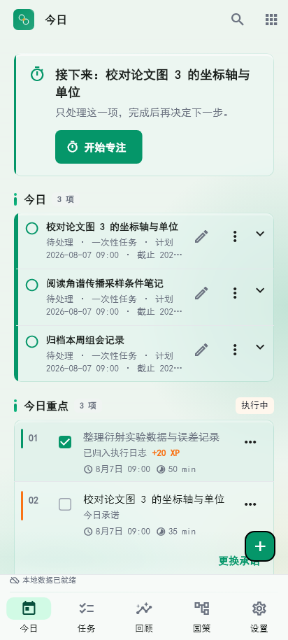
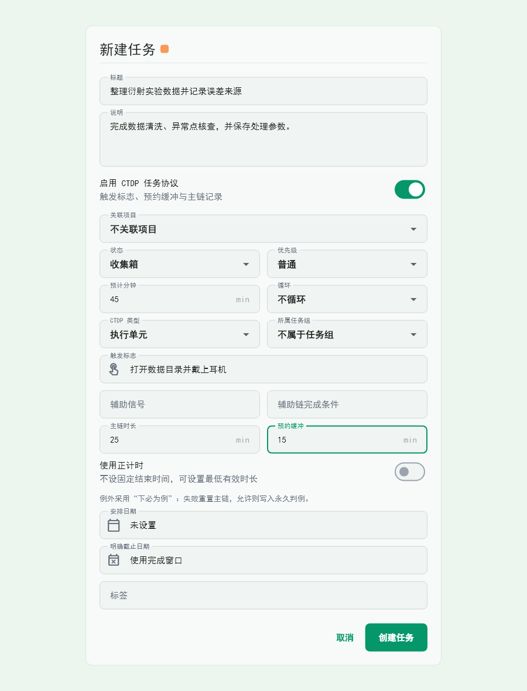
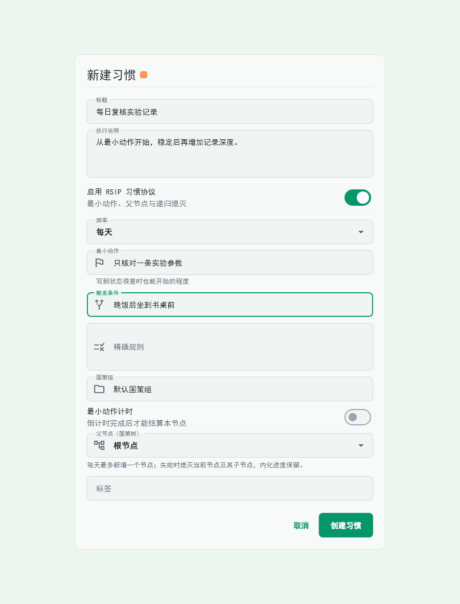

# UI 优化与验收指南

本文记录“个人工作台”当前采用的 UI 方案。目标不是复制参考网页的品牌，而是把它的核心工作流转化为适合本项目的 Flutter 工作台：先收集，再锁定承诺，最后用 CTDP/RSIP 执行和复盘。现代软件秩序约占 80%，东方古籍图鉴细节约占 20%。

> **方向更新（2026-08-19）**：第 1 节与第 5 节的“古纸玉石 / 黛青水墨”国风视觉方向已被替换，当前采用「现代专业工作台 + 绿色系玻璃拟态」（亮色微绿灰白底 + 翠绿主色，暗色深墨绿底 + 亮翠绿，主要面板玻璃化）。本指南第 1、5 节保留作历史参照，第 2-4、6-7 节的组件规范、响应式验收与构建命令仍然有效。最新设计体系以 `DESIGN.md` 为准。

## 0. 玻璃拟态规范（当前生效）

- 主要面板统一使用 `GlassSurface`：`RepaintBoundary → ClipRRect(radius) → BackdropFilter(blur) → glassPanel 填充 + glassBorder 边框 + 顶部 1px glassHighlight 高光 + glassGlow 外发光`。
- 模态对话框使用半透明 `DialogTheme` 面板，并由 `showWorkbenchDialog` 统一模糊模态背景；不要在路由根节点包裹 `GlassSurface`，否则玻璃填充会扩展到整个窗口。
- 圆角默认 12（宽屏）/ 10（窄屏）；全屏区域（侧栏、AppBar、底部导航）使用 `radius: 0` + `glow: false`。
- 玻璃令牌位于 `WorkbenchTokens.glass*`：亮色 `glassPanel #8CFFFFFF`、`glassBorder #26059669`、`glassHighlight #B3FFFFFF`、`glassGlow #1A059669`、`glassBlur 10.0`；暗色 `glassPanel #14FFFFFF`、`glassBorder #2E34D399`、`glassHighlight #33FFFFFF`、`glassGlow #3334D399`、`glassBlur 12.0`。
- 降级开关：`GlassConfig.blurEnabled = false`（或 `GlassSurface.enabled = false`）时回退为 `tokens.panel` 96% 实色 + 常规阴影，用于低端机与「减少透明效果」场景，视觉层次不丢失。
- 背景光晕为玻璃提供“看得见”的模糊源：右上翠绿、左下青绿、右下金色，透明度亮色 6%-18%、暗色 8%-25%。

## 1. 最终视觉方向

### 1.1 亮色：古纸玉石

- 画布：`#F5F1E7`
- 表面：`#FBF8F0`
- 抬高表面：`#FFFCF4`
- 主玉石绿：`#2F6E63`
- 主色容器：`#D8E7DE`
- 正文：`#1F332F`
- 弱文字：`#566860`
- 分隔线：`#C8D2C9`

亮色用于白天记录、计划和表单。玉石绿只承担主操作、选中和成长状态，不把整页染成高饱和绿色；古纸色负责建立温润底色。

### 1.2 暗色：黛青水墨

- 画布：`#152522`
- 表面：`#1D3430`
- 抬高表面：`#27423D`
- 主青绿：`#7CBCAF`
- 正文：`#EDF3ED`
- 弱文字：`#A8B8AE`
- 分隔线：`#49615A`
- 奖励金：`#C4A568`

暗色不直接反相亮色。水墨山石、枝叶和细边框只出现在画布边缘、空状态或专注留白，透明度控制在 2%-5%，不能放到文字和密集表单后面。

### 1.3 国风元素增量

传统色彩令牌：朱红 `#A64B46` / `#D07A70` 用于印章与错误状态，靛蓝 `#596A86` / `#8EA4C3` 用于辅助信息和回纹线，墨黑保留为正文与暗色底层，鎏金沿用 `#8A7136` / `#C4A568` 用于奖励和器物节点。标题使用平台可用的楷体、宋体回退链，正文和操作控件不使用书法字体。

- 页面标题旁增加极简几何印章，使用朱红细线并以鎏金作极小节点，不绘制复杂篆字，避免小尺寸下产生乱码和识别负担。
- 分区标题左侧增加玉佩结点，由圆环和十字线组成，用于建立“图鉴分栏”节奏，不作为交互控件。
- 画布边缘加入单线山脉与云气水印，配合原有竹枝和淡墨曲线；装饰不放在文本、输入框或密集任务行后方。
- 装饰元素必须通过 `ExcludeSemantics` 隔离，不参与焦点顺序；新增自绘只使用主题令牌，保证亮暗主题同步。

## 2. 页面优化优先级

| 优先级 | 页面或组件 | 诊断 | 当前处理 |
| --- | --- | --- | --- |
| P0 | 今日、快速新增、任务编辑器 | 高频入口；旧弹窗在手机上字段多、校验不在字段附近 | 今日沿用时间线结构；任务编辑器在窄屏改为全屏，标题和 CTDP 触发标志内联校验；本轮改用古纸/玉石令牌 |
| P0 | 习惯编辑器、习惯页 | RSIP 最小动作和父节点容易被普通字段淹没 | 窄屏全屏编辑；最小动作增加帮助文字，保留父节点和每日准入规则 |
| P1 | 专注、协议 | 计时、预约和失败状态需要低干扰但高辨识度 | 暗色采用青黑画布，主计时用青绿色，奖励与失败同时使用文字和图标 |
| P1 | 计划、日历、项目 | 桌面信息密度高，宽度不足时容易挤压 | 外壳统一为 `<720`、`720-1199`、`>=1200` 三档；桌面宽屏才显示辅助栏 |
| P2 | 成长、回顾、日记、笔记 | 记录结果多，空状态和筛选反馈不够突出 | 继续复用 `PageHeader`、`LogSurface`、`EmptyState` 和统一分隔线 |
| P2 | 设置、搜索、弹窗和菜单 | 属于低频但影响整体可信度 | 统一圆角、边界、焦点环和危险操作语义 |

## 3. 组件规范

### 导航栏

- `<720dp`：Material 3 `NavigationBar`，固定四项“今日、计划、专注、成长”，其余页面进“更多”。
- `720-1199dp`：72dp 紧凑侧栏，只保留图标和分组刻度。
- `>=1200dp`：236dp 可展开侧栏，提供快速新增、全局搜索和分组导航。
- 选中态同时使用图标、文字和绿色容器，不能只靠颜色。
- 每个图标按钮带 tooltip；触控目标至少 `48dp`。

### 页面标题与分区

- `PageHeader` 使用 3px 绿色竖线、20px 页面标题、12px 弱副标题。
- 分区间距采用 `8/12/16/24px`，基准单位为 `4px`。
- 页面区块优先用留白和 1px 分隔线，不把页面套成多层卡片。

### 表单

- 首屏只放必填标题和最小可执行字段；日期、项目、优先级、标签等按需补充。
- 任务协议顺序：CTDP 类型、触发标志、主链时长、预约缓冲、辅助信号、完成条件。
- 习惯协议顺序：RSIP 最小动作、触发条件、精确规则、国策组、父节点、可选计时。
- 错误放在对应输入框下方，使用 `errorText` 和错误图标；不要用 Snackbar 代替字段错误。
- 输入获得焦点时使用 2px 主色边框；焦点环不能被主题背景吞掉。

### 按钮、卡片与列表

- 主按钮使用实色 Material 3 `FilledButton`，动作文案使用“创建任务”“创建习惯”“开始专注”等具体动词。
- 次要动作使用 `OutlinedButton`，取消使用 `TextButton`；图标按钮使用熟悉图标并提供 tooltip。
- 普通表面圆角 `6px`，弹窗和浮层最多 `8px`，默认无阴影，仅用边界和色阶表达层次。
- 列表行固定最小高度：桌面 `40px`，Android `48dp`。加载和状态变化不得改变行高。
- `StatusPill` 根据前景与背景实际对比度选择文字颜色，状态同时显示文本或图标。

### 空状态、加载和危险状态

- 空状态包含图标、简短标题、下一步动作和一条解释，不使用大插画。
- 加载状态保留布局高度，优先使用骨架或固定占位。
- 删除、清空、恢复备份等不可逆操作使用确认对话框，并说明是否可恢复。
- 离线、同步失败和通知权限拒绝必须在应用内解释，不阻塞本地记录。

## 4. 响应式验收

| 视口 | 必查内容 |
| --- | --- |
| 412x915 | 今日纵向列表、底部导航、快速新增、任务/习惯全屏编辑器、键盘避让 |
| 720x900 | 紧凑侧栏、单主列、协议字段不横向溢出 |
| 1536x864 | 完整侧栏、今日中央时间线、成长辅助栏、日历和项目多栏布局 |
| 大字号 | 标题、错误文字、按钮文字换行后不覆盖相邻控件 |
| 深色主题 | 正文、弱文字、绿色按钮、奖励金和错误容器均保持可读 |

## 5. Stitch 可直接粘贴的提示词

```text
为“个人工作台”生成一套 Flutter Material 3 生产力应用界面。应用用于个人任务、习惯、时间块、专注和科研记录，核心流程是快速收集 -> 锁定今日承诺 -> CTDP/RSIP 执行 -> 成长与回顾。

视觉方向：采用“青绿雅韵新中式”，约 80% 现代软件 UI + 20% 东方古籍图鉴细节。亮色为暖古纸与玉石绿，暗色为黛青水墨，并以低饱和朱红、靛蓝、墨黑、鎏金作为传统色彩点题。不是传统古风网页，不要大面积书法，不要霓虹，不要荧光红和大面积金色。允许绿色系玻璃拟态面板作为主要表面语言（半透明翠绿微光 + 背景模糊 + 顶部高光），保持克制不喧宾夺主。纸张纤维、淡墨、工笔枝叶、山石轮廓、祥云、回纹、缠枝纹和古铜节点只能在画布边缘、空状态、分隔线和专注留白以 2%-7% 透明度出现，不能放在文字或表单后面。

国风组件语言：页面标题旁使用极简朱红印章几何标记；页面分隔线使用细线祥云和回纹组合；分区标题使用靛蓝玉佩结点；空状态和插画使用单色水墨/工笔线稿的竹、兰、山石或器物轮廓。标题字体优先使用可用的楷体/宋体回退链，正文、按钮、菜单和数据使用现代无衬线字体，禁止使用难以辨认的书法字体。

颜色令牌：
- Light canvas #F5F1E7, surface #FBF8F0, raised #FFFCF4, ink #1F332F, muted #566860, divider #C8D2C9, primary #2F6E63, primary-container #D8E7DE, indigo #596A86, reward #8A7136, danger #A64B46。
- Dark canvas #152522, surface #1D3430, raised #27423D, ink #EDF3ED, muted #A8B8AE, divider #49615A, primary #7CBCAF, primary-container #29554D, indigo #8EA4C3, reward #C4A568, danger #D07A70。

布局：<720dp 使用顶部栏、四项底部导航和全屏编辑器；720-1199dp 使用 72dp 紧凑侧栏和单主列；>=1200dp 使用 236dp 分组侧栏、中央主内容和可选辅助栏。间距基准 4px，常用 8/12/16/24px。普通圆角 6px，弹窗最多 8px，卡片无阴影，仅使用 1px 边界和色阶。

页面：今日页优先呈现 1-3 项承诺、下一时间块、时间线和成长刻度；计划页呈现时间块和冲突；专注页只保留当前任务、计时、暂停/完成/退出；成长页呈现 XP、连续记录和证据；设置页使用清晰分组和危险操作确认。

任务创建：移动端全屏“新建任务”，先标题，再 CTDP：触发标志、行为/主链时长、完成条件、预约缓冲和辅助信号；日期、项目、优先级、标签进入按需展开区。习惯创建：移动端全屏“新建习惯”，先名称，再 RSIP：最小动作、触发条件、精确规则、国策组、父节点和可选最小动作计时。

交互状态：默认、hover、pressed、focused、disabled、loading、success、error、empty、offline、syncing、permission denied 全部有明确视觉差异。错误必须显示在字段下方并带图标和文字，颜色不是唯一提示。所有触控目标至少 48dp；支持键盘遍历、可见焦点、屏幕阅读器语义、系统返回键、安全区和大字号。

输出 Android 412x915、平板 800x1280、Windows 1536x864 的 Light/Dark 页面，并保持同一信息架构、文案和组件令牌。
```

## 6. 本地复现和验收命令

```powershell
flutter analyze --no-pub
flutter test --no-pub
flutter test --no-pub test/visual_golden_test.dart --update-goldens
powershell -ExecutionPolicy Bypass -File .\tool\build_windows.ps1 -Configuration release
powershell -ExecutionPolicy Bypass -File .\tool\build_android.ps1 -Configuration debug
```

Windows 构建产物为 `build/windows/x64/runner/Release/personal_workbench.exe`，Android 调试 APK 为 `build/app/outputs/flutter-apk/app-debug.apk`。真实手机验收前必须确认 `adb devices -l` 有 `device` 状态；若为空，检查 USB 调试授权、数据线和 Android SDK `platform-tools`，不要把“APK 编译成功”误认为“真机安装成功”。

## 7. 截图对照








截图由 `test/visual_golden_test.dart` 生成，示例日期和数据固定，便于论文展示与回归比较。真实科研数据不要写入这些固定 fixture。
