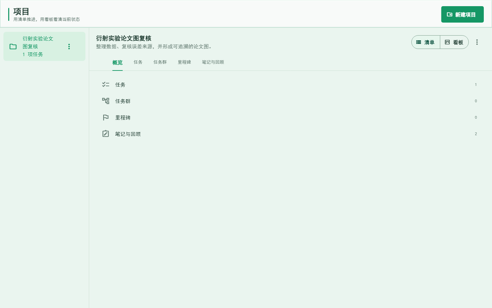
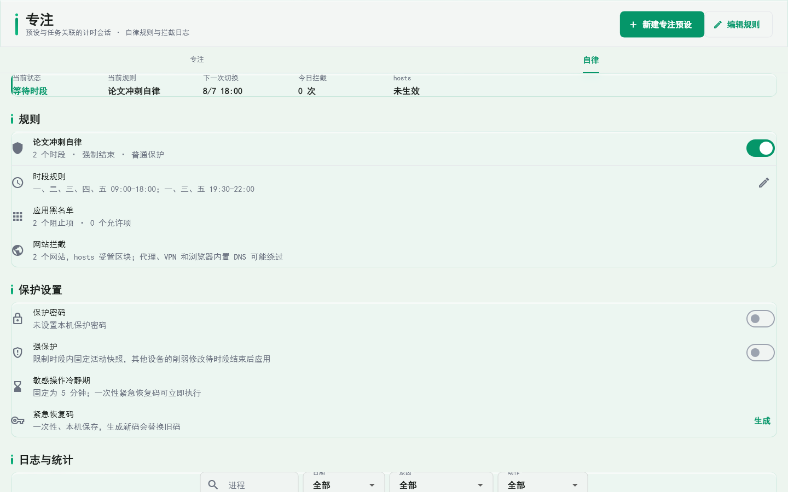
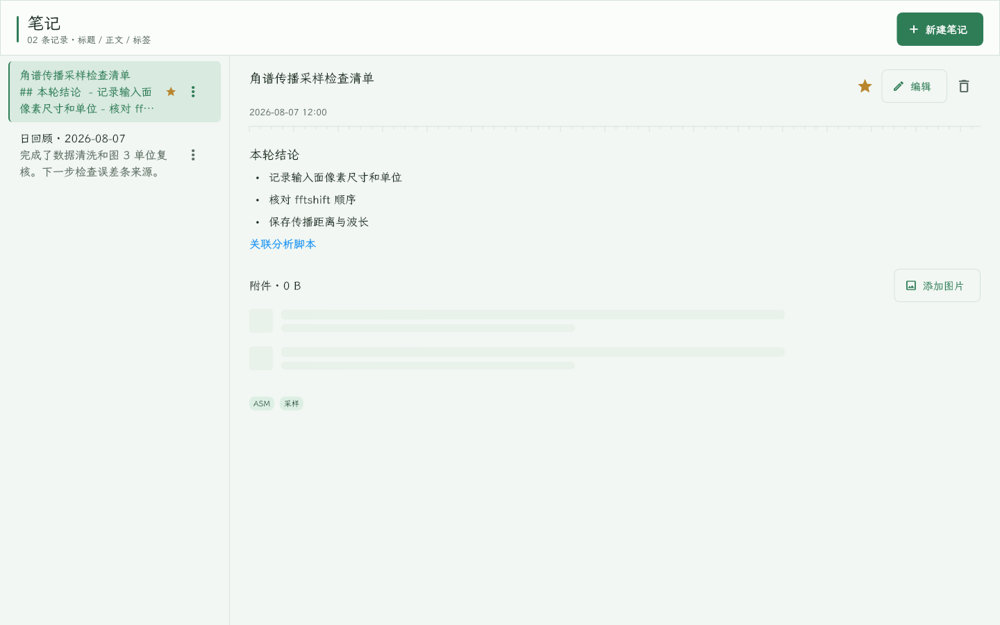
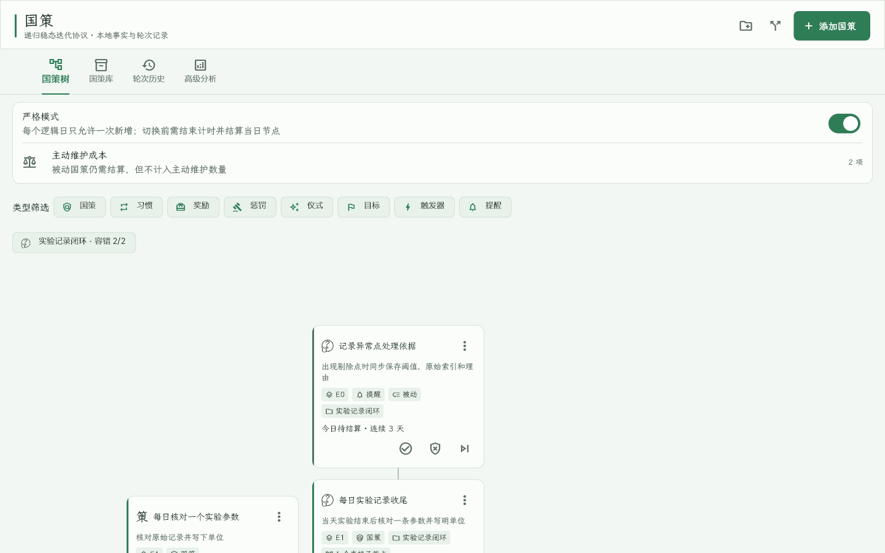
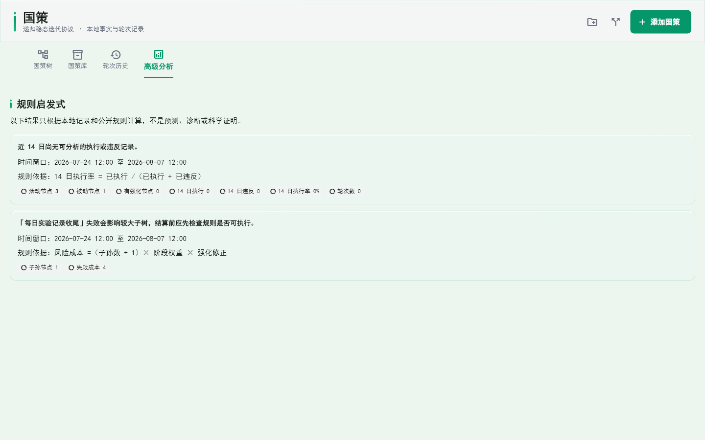

# 个人工作台 新手使用指导

> **平台说明（2026-08-17）**：当前版本仅发布 Android 应用；本手册原先面向 Windows 桌面版编写，其中“桌面/宽屏布局”部分在 Android 平板或大屏设备上仍适用，但系统级交互（托盘、Toast、前台置前、全局快捷键）已不再提供。Android 使用底部导航与「更多」菜单访问各模块，与桌面读取同一套本地记录。

本手册面向第一次使用“个人工作台”的用户。它按当前代码和界面说明操作路径，不把尚未实现的规划功能写成现成功能。建议第一次只完成“创建任务 → 安排今天 → 开始专注 → 完成或结算 → 写日回顾”这一条最小闭环，熟悉后再启用周期任务、任务链、国策和本地激励。

> 重要边界：个人工作台是本地优先的个人执行与科研记录工具，不是医疗、心理或科研结论判定工具。CTDP、RSIP 和 XP 只记录你自己定义的行动证据，不代表实验质量、身体状况或个人价值。

## 0. 先认识这套工作流

应用把一件事拆成五个问题：

1. **要做什么**：在“任务”中记录下一步动作。
2. **什么时候做**：在“今日”或“任务 → 周视图”安排日期和时间。
3. **现在是否开始**：从今日重点或“专注”启动一次计时会话。
4. **最后发生了什么**：把任务结算为完成、失败、跳过、改期或退回收件箱。
5. **如何留下上下文**：在“笔记”和“回顾”中保存 Markdown、图片、链接、事实快照和原因。

Windows 桌面默认打开“今日”。左侧固定八栏，从上到下是：**今日、任务、项目、专注、笔记、回顾、国策、设置**。Android 仍使用底部三栏和“更多”菜单，但与 Windows 读取同一套记录。

## 1. 第一次启动 Windows 版

### 1.1 启动、窗口和数据位置

如果已经有构建好的程序，直接运行 `personal_workbench.exe`。开发者从源码运行时，在项目根目录执行：

```powershell
flutter pub get
flutter run -d windows
```

中文工作区路径导致 CMake 或 MSBuild 报错时，使用项目脚本：

```powershell
powershell -ExecutionPolicy Bypass -File .\tool\build_windows.ps1
```

想要直接测试桌面版时，运行：

```powershell
powershell -ExecutionPolicy Bypass -File .\tool\create_desktop_test_entry.ps1
```

脚本会在桌面生成 `PersonalWorkbench-Windows-Test.lnk`。双击后会构建并启动隔离测试环境，
测试数据库位于 `%LOCALAPPDATA%\PersonalWorkbenchDesktopTest\workbench_test.db`，不会读取正式数据。
若需要验证当前正式数据库，必须先完成加密备份，再显式运行
`tool\run_windows_test.ps1 -UseCurrentDatabase`。

如果需要直接拿到软件入口而不是快捷方式，运行：

```powershell
powershell -ExecutionPolicy Bypass -File .\tool\package_windows_test_entry.ps1
```

完成后打开 `build\desktop_test_entry\personal_workbench.exe`。该目录中的 DLL 和 `data`
文件夹是软件运行所需文件，不能只单独复制 exe。如果旧测试软件仍在运行，脚本会创建
`desktop_test_entry_日期时间` 目录并输出新入口，避免强制关闭软件或覆盖被锁定的文件。

数据默认写入本机应用数据目录，并由 SQLite 管理。不要手动删除数据库文件，也不要把实验原始数据目录当作应用附件目录。第一次正式录入真实资料前，打开“设置 → 数据与备份 → 创建加密备份”。

### 1.2 Windows 首屏和八栏导航

桌面左侧有应用标题、个人别名、快速新增、全局搜索和八个固定页面。导航栏可以用右上角的收起按钮缩窄；收起只改变宽度，不隐藏页面。点击左下角同步状态可以查看本地或云端连接提示。


图 1  Windows 宽屏首屏。左侧是固定八栏和全局入口，右侧的“今日”包含下一步、时间安排和今日重点；状态线、图标和文字共同表达状态，不应只凭颜色判断。

八栏的职责如下：

| 栏目 | 主要用途 | 第一次应做的动作 |
| --- | --- | --- |
| 今日 | 处理当前逻辑日的任务、重点、时间块和收尾 | 添加一项今天要完成的任务 |
| 任务 | 管理全部任务、收件箱、周视图和任务群 | 查看未安排任务并创建周期任务 |
| 项目 | 管理项目、项目任务、任务群、里程碑、笔记与回顾 | 创建一个能描述最终结果的项目 |
| 专注 | 管理专注预设和实际专注会话 | 创建一个正计时或倒计时预设 |
| 笔记 | 编辑 Markdown，预览正文，关联任务/项目，管理图片 | 新建一条实验方法或决定记录 |
| 回顾 | 在单一页面切换日、周、月，核对事实并管理回顾库 | 收尾后保存自动打开的日回顾草稿 |
| 国策 | 管理 RSIP 国策树、国策库、轮次历史和分析 | 添加一个足够小的根节点 |
| 设置 | 逻辑日、提醒、托盘、检测、备份、同步和实验功能 | 先备份，再调整提醒和隐私开关 |

### 1.3 三个全局入口

- **快速新增**：打开一个轻量表单，先写一句话，再决定是否完善日期、项目、协议等字段。
- **全局搜索**：Windows 使用 `Ctrl+K`，可搜索任务、项目、笔记、日记、目标和链接；在笔记页进入时默认筛选“仅笔记”。
- **系统级快速收集**：Windows 使用 `Ctrl+Shift+Space`。应用不在前台时也会尝试呼出快速新增；若快捷键被其他程序占用，应用仍可从侧栏按钮使用。

页面底部的操作提示会自动消失，也可以点击关闭图标收起；提示含“撤销”时仍可直接撤销。连续产生新提示时，旧提示会先收起，不会在底部排队遮挡正文。使用键盘时可以按 `Tab` 聚焦关闭或撤销按钮，再按 `Enter` 执行。

## 2. 快速新增和完整表单

### 2.1 快速新增适合什么场景

快速新增只解决“先把信息放下来”。它不会要求你马上决定所有字段。支持四种类型：

| 类型 | 输入内容 | 保存后的去向 |
| --- | --- | --- |
| 任务 | 一句话动作，如“核对图 3 坐标轴单位” | 任务列表；从今日进入时默认安排到当前逻辑日 |
| 笔记 | 一段方法、想法或决定 | 笔记列表，稍后可转 Markdown 编辑器 |
| 今日记录 | 当天事实、阻塞和下一步 | 当前逻辑日的记录，适合收尾前快速记事 |
| 链接 | `http://` 或 `https://` 地址 | 链接记录；应用保存地址，不下载网页全文 |

操作步骤：

1. 点击侧栏“快速新增”，或按 `Ctrl+Shift+Space`。
2. 在“类型”下拉框中选择任务、笔记、今日记录或链接。
3. 在输入框写标题、正文或网址。任务和链接可按回车提交；笔记和今日记录建议多写几行。
4. 点击“收下”只保存最小记录；点击“完善信息”进入完整编辑器。
5. 标题为空、链接不是 `http://` 或 `https://` 时，表单会显示错误且保留输入内容。


图 2  新安装的空白今日页。没有演示任务时，页面只突出“添加今天的第一项任务”，避免新手在空白页面中寻找入口。

### 2.2 完整任务表单的每个字段

在快速新增中点击“完善信息”，或在“任务”页点击“新建任务”，会打开完整编辑器。常用字段如下：

| 字段 | 作用 | 建议填写方式 |
| --- | --- | --- |
| 标题 | 任务名称 | 用“动词 + 对象”，例如“导出样品 A 的强度图” |
| 说明 | 完成标准、输入、输出和备注 | 写清怎样才算完成，不要只写“处理数据” |
| 关联项目 | 任务的主项目 | 一个任务保留一个主项目；暂时不确定可选“不关联项目” |
| 状态 | 收集箱、待办、进行中、已完成等 | 新想法先放收集箱，确定下一步后改为待办 |
| 优先级 | 今日排序依据 | 只表达相对先后，不等同于科研结论重要性 |
| 预计分钟 | 一次执行的预估时长 | 按一轮专注能完成的范围填写，过大就拆任务 |
| 安排日期 | 归属逻辑日 | 需要近期执行才填写；未决定日期就留在收集箱 |
| 截止时间 | 明确的外部期限 | 只有确有期限时填写；愿望不要伪装成截止时间 |
| 循环 | 自动生成未来实例 | 选择不循环、每天、工作日、每周、每月或每年 |
| 每周执行日 | 每周循环时的星期 | 只在“每周”规则下出现 |
| 标签 | 搜索和筛选关键词 | 使用稳定短词，如 `ASM`、`样品A`、`数据处理` |
| CTDP 协议 | 触发、预约、主链和完成证据 | 只有需要严格执行规则时打开 |

保存任务后，任务标题、安排日期、截止时间、状态和项目关系仍可从任务行的编辑按钮修改。已产生的专注记录、协议事件和收尾快照不会因为普通编辑而被删除。

### 2.3 新手的任务命名法

- 项目写最终结果：“完成样品 A 成像实验数据整理”。
- 任务写下一步：“整理样品 A 的暗场背景并导出 CSV”。
- 里程碑写阶段结果：“完成背景扣除方法确认”。
- 笔记写方法、参数和决定；回顾写当天发生的事实。

## 3. 今日：当前逻辑日的执行台

### 3.1 逻辑日和页面三段

默认逻辑日从凌晨 **04:00** 开始，到次日 04:00 结束。设置中的逻辑日分界可以改为 `00:00` 到 `06:00`；修改只影响未来生成的周期实例，不重写过去记录。

今日页固定显示三段：

1. **逾期待结算**：超过完成窗口但还没有结算的任务。它不会自动伪造失败原因。
2. **今日**：当前逻辑日需要处理的任务，包含一次性任务和按周期生成的实例。
3. **已结算**：完成、失败、跳过、改期或退回收集箱后的历史结果。结算后任务仍保留，便于解释当天发生了什么。


图 3  今日执行台。下一步卡片只突出一个主动作；右侧今日重点最多保留三项；下方时间安排显示时间块和冲突提示。

### 3.2 创建今天的第一项任务

1. 进入“今日”。
2. 点击“添加今天的第一项任务”，或点击侧栏“快速新增”。
3. 输入一个可验收的标题，例如“核对图 3 的坐标轴单位”。
4. 点击“收下”。从今日页打开时，任务会自动带上当前逻辑日和待办状态。
5. 如果任务确实有项目、截止时间、循环或 CTDP，再打开“完善信息”补充。

任务保存后不会自动从今日重点消失。它先出现在今日任务区，待你点击“开始今天”后才进入重点选择。

### 3.3 开始今天和调整重点

点击“开始今天”后，系统从当前逻辑日未完成的任务中自动选择最多三项，排序依据是：优先级、安排或截止时间、创建时间。确认后右侧显示“今日重点”。

- **调整重点**：在尚未开始专注、尚未产生完成证据时重新选择 1 到 3 项。
- **更换承诺**：替换某一项重点。任务已经开始专注或完成后会受到保护，避免事后改写承诺。
- **开始专注**：直接为当前下一步建立一次专注会话，不需要先切换到专注页面。

### 3.4 时间安排和冲突

点击“时间安排”旁的“安排”，选择任务、日期、开始时间和持续分钟数。时间块以 5 分钟为单位吸附，允许跨越午夜；跨日工作仍按逻辑日统计。两个时间块重叠时显示“时间冲突”，应修改开始时间或分钟数。删除时间块只删除“何时做”的安排，不删除任务本身。

### 3.5 结算任务

任务完成或失败后仍保留在页面中。状态使用浅色背景、左侧状态线、图标和文字共同表达：

| 状态 | 什么时候使用 | 必填或附加信息 |
| --- | --- | --- |
| 完成 | 结果已经达到完成标准 | 可填写结果说明、链接或本地图片 |
| 失败 | 本期明确没有完成 | 失败原因必填，可选模板后补充说明 |
| 跳过 | 本期决定不执行，但不是失败 | 建议填写为什么跳过 |
| 改期 | 原实例结束，另建一个目标日期实例 | 原实例保留“已改期”，新实例与原实例关联 |
| 退回收件箱 | 还没准备好安排，不进入失败统计 | 适合信息不足或外部依赖未明确的任务 |

点击已结算任务右侧的更多按钮可以查看结果、原因和改期关系。不要用删除来代替结算；删除会让事实链难以追溯。

### 3.6 每日收尾和自动进入回顾

点击“完成每日收尾”后，所有未结算任务必须逐项选择失败、跳过、改期或退回收件箱。选择失败时必须填写原因；选择改期时必须指定新的目标日期；选择退回收件箱时建议写清阻塞原因。

收尾会完成四件事：

1. 冻结当天任务、专注、时间安排和结算状态的事实快照。
2. 保存“每日收尾快照”作为可追溯记录。
3. 自动创建或打开当天的“日回顾”草稿，并切换到“回顾 → 日记”。
4. 当天不重新开放；如果必须修正，可使用带操作者、时间和原因的留痕更正。

日回顾草稿必须点击“保存日回顾”才算完成。只打开或只输入正文而没有保存，仍属于草稿状态。

## 4. 任务：四个子视图和任务群

### 4.1 全部、收件箱、周视图、任务群

“任务”页固定有四个标签：

- **全部**：按日期、截止时间和创建时间查看所有任务实例。
- **收件箱**：查看没有安排日期、没有项目或仍需决定下一步的内容。
- **周视图**：按周一至周日排列任务和时间块；宽屏为七列，窄窗口变为按日纵向列表。
- **任务群**：创建并行任务群或顺序任务链，查看锁定、完成和调整历史。


图 4  周视图示例。每列代表一天，任务块显示时间和冲突状态；宽屏适合比较一周，窗口变窄后页面会改为纵向阅读。

### 4.2 周期任务和实例

周期任务由“定义”和“实例”组成：定义保存标题、频率和完成窗口；实例代表某一个逻辑日的一次执行。系统按需生成未来约 90 天实例，避免一次性制造过多记录。

可选频率：

- 每日。
- 工作日（周一至周五）。
- 每周指定日。
- 每月指定日；遇到较短月份时按实现规则落到当月有效日期。
- 每年指定日。

编辑周期任务时会询问范围：

1. **仅修改本次**：只影响当前实例。
2. **修改本次及未来**：当前实例和后续未开始实例使用新规则。
3. **修改整个周期**：修改任务定义；已经结算的历史不会被批量改写。

周期任务某一次失败不会自动暂停后续实例。逾期实例先进入“逾期待结算”，不会自动生成一个你没有写过的失败原因。

### 4.3 任务群和任务链

点击“任务 → 任务群 → 新建任务群”，填写名称、模式和可选总时限：

- **并行任务群**：成员可以按任意顺序执行。
- **顺序任务链**：第一个成员通过后才解锁下一个成员。
- **总时限**：只限制群级窗口；每个子任务自己的 CTDP 时长仍独立保存。

添加已有任务时，应用会阻止一个任务同时加入多个活动任务群。顺序链的未到达节点显示锁图标；前置任务失败后，后续节点保持锁定。只有明确点击“跳过并继续”才会解锁后续节点。

链条开始后可以用上移、下移调整尚未开始的节点。每次调整都要求填写原因，并记录任务群版本历史。旧版 CTDP 嵌套组会以“旧版 CTDP 嵌套组”兼容区域显示，不会因为新任务群功能而删除。

### 4.4 CTDP 任务协议

CTDP 是任务执行规则，不是第二套任务。普通任务不需要开启；需要触发标志、预约缓冲、主链或辅助链时再打开“启用 CTDP 任务协议”。


图 5  CTDP 任务表单。可以填写触发标志、主链时长、预约缓冲、辅助信号、任务组和正计时选项。

字段和操作：

1. **触发标志**：写下开始前必须做的可观察动作，如“打开数据目录并戴上耳机”。
2. **预约缓冲**：预约后，在缓冲时间内完成触发动作并确认开始。
3. **主链时长**：固定一次执行时长；需要不设固定结束时间时切换正计时，并设置最低有效时长。
4. **辅助信号和辅助完成条件**：用于记录预约触发链，不自动替代任务完成。
5. **完成证据**：结束专注或完成任务时写结果说明；空泛的“做完了”不利于复盘。
6. **失败和超时**：只重置 CTDP 链并留下协议事件；不会自动把任务实例结算为失败。任务是否失败仍由你在今日页面明确选择。

## 5. 项目：左侧列表和右侧详情

### 5.1 创建和选择项目

进入“项目”，点击“新建项目”，填写名称、说明、截止日期和标签。项目名称描述最终成果，不要把“今天整理数据”这种一次动作当项目。

Windows 宽屏左侧显示项目列表，右侧显示当前项目；窗口较窄时使用“当前项目”下拉框。项目列表按当前记录显示，点击某一项即可切换详情。



图 6  项目页采用主从布局。左侧选择项目，右侧在概览、任务、任务群、里程碑、笔记与回顾之间切换；列表和标题右侧的更多菜单都能编辑或移入回收站。

### 5.2 五个详情页签

右侧详情固定包含：

1. **概览**：任务、任务群、里程碑、笔记与回顾的数量摘要。
2. **任务**：新增项目任务，切换“清单”或“看板”；看板按待办、进行中、已完成等状态查看。
3. **任务群**：显示任何成员与当前项目有关联的任务群。
4. **里程碑**：添加阶段性结果，勾选完成或编辑里程碑。
5. **笔记与回顾**：显示关联当前项目的笔记和期间回顾。

一个任务保留一个主项目。笔记和回顾可以关联多个项目；同一任务如果还需要被其他项目引用，应使用关系字段而不是复制任务。首版不支持多层子项目树。

### 5.3 项目内新增

- 在“任务”页签点击“新增任务”，任务会自动带上当前项目。
- 在“里程碑”页签点击“添加”，里程碑直接挂到当前项目。
- 在笔记或回顾编辑器的关联按钮中勾选项目，项目详情会自动显示它们。
- 编辑项目不会改写已经完成的任务和回顾事实。

### 5.4 编辑、删除和恢复项目

项目有两个等价入口：左侧项目项右侧的更多菜单，以及右侧标题区的更多菜单。选择“编辑”后修改名称、说明、日期或标签；保存成功后仍保持当前项目选中。表单校验失败时错误显示在表单内，原项目不会被替换。

选择“移入回收站”前，对话框会列出关联任务、任务群、笔记、回顾和里程碑数量。确认后只软删除项目本身：

- 任务、任务群、笔记、回顾和里程碑不会级联删除。
- 关系不会被静默解除；相关任务会显示“项目在回收站”。
- 在“设置 → 数据与备份 → 回收站”恢复项目后，关系自动恢复正常显示。
- 只有永久删除项目时才不可恢复；永久删除前应先创建加密备份。

## 6. 专注：预设、会话和 Windows 后台能力

### 6.1 预设和会话的区别

“专注”页管理的是可重复使用的**专注预设**；点击“开始”后才产生一次具体的**专注会话**。专注会话最多关联一个主任务，也可以选择“临时专注”而不关联任务，避免把同一段时间重复记到多个任务。

点击“新建专注预设”，可填写：

| 字段 | 可选值或作用 |
| --- | --- |
| 预设名称 | 例如“论文图表复核” |
| 计时模式 | 正计时、自定义倒计时 |
| 时长 | 倒计时的分钟数；正计时不要求固定结束 |
| 主任务 | 选择一个任务，或选择“临时专注” |
| 应用检测模式 | 不使用名单、白名单、黑名单 |
| 应用进程名 | 以逗号分隔，如 `chrome.exe, matlab.exe` |
| 此预设启用前台检测 | 总开关打开后，每个预设仍可独立关闭 |
| 定时启动提醒 | 不定时、单次、每周指定日 |
| 星期和时间 | 每周模式选择星期；单次模式选择日期和时间 |
| 定时专注显示工作台 | 到点后恢复托盘/最小化窗口并尝试置前；新预设默认开启 |


图 7  专注页只保存预设和会话，不另建一套任务。预设行可编辑或开始，下一项承诺可以直接进入专注。

桌面侧栏“执行”分组下提供“专注”和“自律”两个独立入口。自律页可管理限制时段、应用与网站名单、保护设置和拦截日志；开机启动、关闭窗口进入托盘以及 hosts 诊断统一放在主设置。Android 端只编辑并同步规则，实际进程结束和 hosts 限制仅由 Windows 执行。



图 8  自律页使用独立入口，内置原 SelfControl 的脱敏规则并默认停用；保护状态摘要可跳转到主设置进行系统级配置。

### 6.2 开始、确认和完成会话

1. 从今日重点点击“开始专注”，或在专注预设卡片点击“开始”。
2. 选择正计时或倒计时；如果是定时预设，先在提醒卡片点击“确认开始”。
3. 计时过程中可以暂停、结束或根据 CTDP 提示处理中断。
4. 结束时点击“完成本次专注”，填写本轮完成内容和备注。
5. 保存后产生一条专注记录，实际分钟数写入任务和回顾统计。

定时启动不会在没有确认时伪造时长。到点顺序固定为：写入待确认状态、发送 Windows Toast、恢复最小化或托盘窗口、尝试置前、显示“确认开始 / 跳过”。Windows 不允许抢占焦点时，应用改为闪烁任务栏并保留 Toast。两个预设同一时刻冲突时，页面会要求选择一个；跳过或未确认的预设记录为错过启动事件。

### 6.3 锁屏、休眠和前台应用检测

- 锁屏后会话按实际时间继续。
- 系统休眠时会暂停；唤醒后弹出“继续或结束”，中断会写入会话记录。
- 前台检测默认关闭。打开后只保存应用标识、开始时间、持续时间和关联预设。
- 不保存窗口标题、按键、网页历史、文件路径或输入内容。
- 黑名单只提醒并记录，不强制关闭应用；首版不检测网页 URL。
- 前台日志本地保留 30 天，可在“设置 → 专注与检测 → 前台日志”立即清除，不上传云端。

### 6.4 Windows 通知、托盘和退出

Windows 原生层提供 Toast 通知和托盘图标。关闭窗口时如果打开“最小化到托盘”，窗口会隐藏但应用进程继续运行，计时和应用内定时提醒仍可工作。托盘右键菜单：

- “打开工作台”：恢复窗口。
- “退出”：真正关闭进程。

“设置 → 通知与后台 → 真正退出”也会停止托盘、计时和后台提醒。开机启动默认关闭，只对当前 Windows 用户生效。

> 重要边界：只有“关闭到托盘”时后台提醒才继续。真正退出进程后，应用不承诺继续发送定时专注提醒，也不会在没有用户确认时强制开始计时。

## 7. 笔记：Markdown、链接和本地图片

### 7.1 新建和编辑

进入“笔记”，点击“新建笔记”。桌面宽屏左侧是笔记列表，右侧是阅读器；窗口较窄时点击列表项直接进入编辑器。正文使用 Markdown，可在工具栏插入标题、粗体、斜体、列表、引用、代码、链接和分隔线。

编辑器上方的“预览”按钮在编辑和渲染结果之间切换；“关联任务和项目”按钮打开多选面板；历史按钮在存在正文版本时显示。



图 9  笔记页左侧用于选择、收藏和打开更多菜单，右侧用于阅读、编辑、删除、添加图片和查看标签。链接在预览中可点击。

### 7.2 图片附件

1. 先保存笔记草稿。
2. 在阅读器或编辑器下方的“附件”区域点击“添加图片”。
3. 选择 PNG、JPEG、GIF、WebP 或 BMP 文件。
4. 单张图片超过 20 MB 会被拒绝；面板会显示本条笔记附件总空间。
5. 点击图片可预览，点击删除只移除附件，不删除笔记正文。

图片会复制到应用附件库，并在 SQLite 中保存文件名、大小、哈希和所属记录。不会保存脆弱的外部绝对路径。备份时会校验哈希；云端只有正文、关系和附件元数据时，另一台设备会显示“附件未下载”。首版不做 OCR、裁剪、标注和在线图床。

### 7.3 关系和正文版本

笔记可以关联多个任务和多个项目。正文每次保存都会保留最近 10 个版本；点击历史按钮，选择版本后可以恢复。恢复前先确认当前草稿已经保存，因为恢复会替换编辑区内容。

### 7.4 编辑、删除和附件清理

笔记索引项、阅读器标题区和编辑器都提供编辑与删除入口。删除前会再次确认；移入回收站后自动选择下一篇可见笔记。此时附件文件和 SQLite 元数据仍保留，所以恢复笔记后图片仍能使用。

在“设置 → 回收站”永久删除笔记时，应用才删除该笔记的附件文件和元数据。永久清理会按附件所属记录逐项执行；发生文件错误时会保留错误提示，不会假装清理成功。执行永久删除前应创建加密备份。

## 8. 回顾：单页切换日、周、月和回顾库

### 8.1 期间切换和默认事实

进入“回顾”后不会打开三个彼此独立的子页面。顶部的 **日 / 周 / 月** 分段按钮只切换当前页面的期间状态；左右箭头切换上一期间或下一期间，“本期”返回当前逻辑日、当前周或当前月。

- 日回顾按逻辑日计算，默认显示当前逻辑日。
- 周回顾固定按周一至周日计算。
- 月回顾按自然月计算。
- 每个期间只允许一篇主回顾；重复选择同一期间会打开原稿，不会产生副本。
- 旧年回顾只在回顾库“历史年回顾”筛选中只读显示，不能新建，也不再提醒。


图 10  回顾页先显示本期间事实，再显示正文编辑器。每项任务都保留项目、任务群或任务链、状态、完成时间、结果、失败原因和改期信息。

“期间事实”不是空白模板。未保存回顾时使用实时数据，依次列出：

1. 完成、失败、跳过、改期和专注分钟汇总。
2. 期间内每个任务实例及其当前状态。
3. 任务所属项目、任务群或顺序链位置。
4. 完成时间、结果说明、失败/跳过原因和改期来源/去向。
5. 任务群模式及期间相关成员状态；任务群本身没有独立结算时，页面不会伪造一个群完成结果。

### 8.2 添加回顾、编辑和保存

点击右上角“添加回顾”：

1. 选择“日 / 周 / 月”。
2. 点击“目标期间”选择日期、周或月份。
3. 点击“打开”。该期间已有回顾时直接打开；没有时建立草稿。
4. 在 Markdown 工具栏使用粗体、斜体、标题、列表或链接；“编辑 / 预览”切换源码和渲染结果。
5. 点击关系图标多选任务和项目。
6. 点击“保存日回顾 / 保存周回顾 / 保存月回顾”。第一次保存时冻结事实快照，草稿才变为已完成回顾。

每日收尾会自动创建或打开当日日回顾草稿并跳转到这里。只打开草稿不算完成；必须保存正文。保存后可继续添加本地图片附件，图片和链接规则与笔记相同。

### 8.3 事实快照、留痕更正和版本

第一次保存后，回顾保留当时的任务、专注、项目活动和任务结算快照。以后编辑任务不会静默改写旧回顾。任务做留痕更正后，页面显示“统计已变化”：

1. 点击“刷新统计”。
2. 填写“刷新原因（必填）”。
3. 系统记录刷新时间、刷新前摘要、刷新后摘要和原因。
4. 手写正文保持原样，不会自动生成或重写。

正文每次改变并保存时保留可恢复版本。点击“恢复正文版本”查看保存时间并恢复；恢复只替换正文，事实快照仍按当前回顾的刷新记录管理。

### 8.4 跳过和回顾库

点击“跳过本期”必须填写原因。跳过会停止该期间的逾期提醒，但不会删除任务事实、专注记录或已有正文版本。

点击右上角“回顾库”进入完整列表：

- 用“全部回顾 / 日记 / 周记 / 月记 / 历史年回顾”筛选。
- 按日期倒序查看期间、保存时间、草稿/完成/跳过状态。
- 在搜索框按标题或正文查找。
- 点击普通回顾回到对应期间继续编辑；点击旧年回顾打开只读窗口。
- 点击“返回编辑”回到先前选中的期间。

### 8.5 默认提醒时间

默认提醒为：日回顾 21:30、周回顾周日 20:00、月回顾月末 20:00。可以在“设置 → 回顾与提醒”分别关闭或修改时间。逾期回顾每天提醒一次，直到保存或明确跳过；旧年回顾没有新提醒。

## 9. 国策：公开源码语义对齐的 RSIP 工作台

### 9.1 国策树、四个页签和八种节点

进入“国策”默认打开“国策树”。树的根在下、子节点在上；支持缩放、平移、分支折叠和类型筛选。首版不使用拖拽改变父级，避免误移动整棵子树。



图 11  国策树把结构、严格模式、主动维护成本和当天操作放在同一页。顶部四个页签依次是国策树、国策库、轮次历史、高级分析。

顶部按钮：

- **新建国策组**：建立并行的国策组，设置 Emoji 和每轮初始容错次数。
- **拆分目标**：把一个目标说明拆成一批同父同组的子国策。
- **添加国策**：打开正式节点表单。

“添加国策”的字段按实际含义填写：

| 字段或开关 | 作用 | 注意 |
| --- | --- | --- |
| 标题 * | 节点名称 | 写可观察的行动或结果，不写抽象愿望 |
| 精准规则 * | 什么条件算执行/违反 | 必须能在当天结束时判断 |
| 节点类型 | 国策、习惯、奖励、惩罚、仪式、目标、触发器、提醒 | 只负责分类、图标、颜色和筛选 |
| Emoji/标记 | 节点的快速识别符号 | 可留空 |
| 父节点 | 选择已有节点或作为根节点 | 系统阻止循环引用 |
| 国策组 | 选择组或不分组 | 组决定容错和归档范围 |
| 被动国策 | 仍需每日结算，但不计入主动维护成本 | 被动不等于不记录 |
| 启用节点计时 | 执行前启动倒计时 | 1-180 分钟，计时结束后仍需明确结算 |

类型筛选只隐藏不符合条件的节点，不删除节点；点击“清除”恢复全部。节点卡片会显示阶段、被动标记、国策组、今日结算状态、连续天数和操作菜单。

### 9.2 新建国策组和拆分模式

点击“新建国策组”填写组名称、Emoji 和“每轮初始容错次数”。容错是当前轮次的余额，不是永久次数；违反时先显示预览，再按规则消耗强化层或容错。

点击“拆分目标”后：

1. 填写“目标说明 *”。
2. 选择共同父节点和共同国策组。
3. 可直接套用作息、运动、饮食模板。
4. 点击“添加子国策”，逐行填写标题、精准规则和“被动”开关。
5. 删除不需要的行后点击“批量创建”。

同一次批量创建生成一个拆分批次；所有节点是同父同组兄弟，并保存 `splitFromGoal`。严格模式把这个批次视为当天的一次新增，不会因为一次批量操作绕过每日限制。

### 9.3 严格模式、阶段和每日唯一结算

“严格模式”默认开启。页面显示“主动维护成本”，只统计非被动活动节点。切换严格/自由模式前必须：

- 没有运行中的国策计时。
- 当天没有待结算节点。
- 切换写入轮次历史。

每个节点每个逻辑日只允许一个有效结算：**已执行、已违反或跳过**。重复点击不会重复累计；需要改动时使用“留痕更正结算”，填写更正为、结算说明和更正原因。旧状态、原时间和操作者信息都会保留。

连续执行 7 天进入 E1，连续执行 21 天进入 E2；E2 节点可以增加强化层。旧版百分比内化值保留为历史经验，不再决定 E0/E1/E2。

### 9.4 执行、违反、跳过和崩塌预览

节点菜单提供“标记已执行”“标记已违反”“跳过今日”“开始计时/完成计时”。执行前可先做最小动作，再按精准规则确认；计时结束不会自动伪造执行。

点击“标记已违反”会先打开预览，展示违反原因、强化层扣减、组容错变化、受影响子树和可能进入国策库的节点。确认后：

1. 有强化层时先扣强化层。
2. 没有强化层时消耗本轮国策组容错。
3. 组仍有容错时，只保留节点和历史，显示剩余容错。
4. 组容错耗尽时归档整组活动节点及子树。
5. 无组节点违反时归档自身子树。

“跳过今日”会打断连续执行，但不触发节点或国策组崩塌；跳过原因仍写入记录。违反原因必填，可继续填写修复建议。CTDP 失败只重置 CTDP 协议链，不会自动把任务实例标成失败，也不会替用户结算 RSIP。

### 9.5 移动、恢复和四个页签

点击节点菜单的“移动到……”会显示受影响子树、新父节点和调整原因；确认后只影响结构，不改历史结算。移动到自己的子孙节点会被阻止。

- **国策库**：保存违反崩塌、主动结束和旧版迁移节点。显示累计执行、当前阶段、最高强化、最近活动和历史使用次数；恢复时选择作为新根或挂到有效父节点。
- **轮次历史**：记录轮次开始、结束、持续天数、峰值节点、崩塌原因和节点列表；创建、执行、违反、恢复和模式切换事件可追溯。
- **高级分析**：显示 14 日等时间窗口、活动/强化/E2/执行/违反输入指标和规则依据。



图 12  高级分析明确标注“规则启发式”，只根据本地记录和公开规则计算，不宣称预测、诊断或科学证明。

### 9.6 任务双向联动

在节点菜单选择“任务联动……”后：

1. 选择关联任务或任务群。
2. 可设置“任务完成 → 自动标记国策执行”。
3. 可设置“任务中断 → 自动标记国策违反”。
4. 国策执行后可选择“询问是否操作任务”，确认后开始任务/任务群或安排到今天。
5. 保存后同一节点、同一逻辑日的同一联动只触发一次。

默认方向是任务 → RSIP 自动；RSIP → 任务需要用户确认。任务完成、任务中断和任务群周期完成都保留原任务事实，不把联动结果伪装成手动点击。

## 10. 设置：按分组管理所有后台能力

### 10.1 账户与同步

“账号与同步”用于 Supabase 注册、登录、退出和手动同步。云同步默认关闭；离线时继续使用本地 SQLite。虚拟积分和专注押注账本只保留在本机，不进入 Supabase。日记和笔记不是端到端加密，同步科研敏感内容前应确认数据管理要求。

### 10.2 外观与导航

- **主题**：跟随系统、浅色或深色。
- **个人别名**：修改侧栏标题下方的显示名称。
- **默认折叠 Windows 侧栏**：只改变导航宽度，不隐藏页面。

### 10.3 任务与周期

- **逻辑日分界**：可选 `00:00` 到 `06:00`，修改只影响未来周期实例。
- 周期任务的频率、执行日、完成窗口和编辑范围在任务编辑器中设置。
- 每日收尾的处置方式在今日页选择，不能通过设置绕过失败原因或改期日期。

### 10.4 专注与检测

- **前台应用检测**：总开关，默认关闭。
- **前台日志**：显示本地记录保留规则并支持立即清除。
- 白名单、黑名单和每个预设的检测开关在“专注 → 专注预设”中设置。

### 10.5 回顾与提醒

日、周、月三种新回顾分别有开关和提醒时间；历史年回顾只能读取，不创建提醒。关闭某一种提醒不会删除已经存在的回顾。逾期回顾的每日提醒也会随该类型开关关闭而停止。

### 10.6 通知与后台

- **关闭窗口时最小化到托盘**：启用后关闭按钮隐藏窗口。
- **开机启动**：默认关闭，仅当前 Windows 用户。
- **真正退出**：停止托盘、计时和后台提醒。
- **任务和休息提醒**：Windows 使用 Toast/托盘提示；Android 使用系统通知权限。通知未显示时，应用内记录仍然有效。

### 10.7 数据与备份

#### 创建加密备份

1. 点击“创建加密备份”。
2. 输入至少 8 个字符的密码，并把密码与文件分开保存。
3. 保存生成的 `.pwb` 文件。备份包含本地记录、附件元数据和可打包的附件文件。
4. 忘记密码无法恢复；应用不会替你保存备份密码。

#### 恢复、导入和导出

- 恢复前先为当前数据创建新备份。
- 选择 `.pwb` 后先查看预览，确认数量和附件范围，再确认恢复。
- 恢复会替换当前本地数据，不会自动覆盖云端。
- “导出 JSON”适合迁移和程序处理；“导出本地游戏状态”额外包含积分和押注账本。
- 支持导入 JSON、CSV、Markdown、TXT。导入不是自动去重，重复导入同一文件可能产生副本。

### 10.8 实验功能

成长、XP、签到和专注押注等历史数据仍保留，但入口收进“实验功能”折叠区。关闭实验功能只隐藏入口和提示，不删除本地记录；重新开启后可以继续读取原账本。

#### 回收站和示例内容

移入回收站是软删除，可以恢复；“永久删除”不可恢复。设置中的“清除首次使用示例”只删除带示例标记的内容，不碰真实记录。

## 11. 一天的推荐操作顺序

### 早上：约 3 分钟

1. 打开“今日”，查看逾期和今日任务。
2. 通过“任务 → 收件箱”处理一两条未安排内容。
3. 点击“开始今天”，确认最多三项重点。
4. 为第一项重点点击“开始专注”。

### 执行中

1. 新想法先按 `Ctrl+Shift+Space` 收下，不打断当前会话。
2. 结束专注时填写结果说明；不要只依赖计时器结束提示。
3. 任务需要触发和预约约束时再使用 CTDP；普通重复行为使用周期任务，只有需要树状规则时才使用 RSIP。
4. 发现时间冲突时编辑时间块，不要删除原任务。

### 晚上：约 5 分钟

1. 在今日页处理所有未结算任务。
2. 失败填写原因；改期选择新日期；暂时无法安排的任务退回收件箱。
3. 点击“完成每日收尾”。
4. 在自动打开的“回顾 → 日记”中补充事实、阻塞和下一步，并点击保存。

### 每周：约 15 分钟

1. 在“任务 → 周视图”检查周一至周日的安排和冲突。
2. 在“回顾”顶部切换到“周”，刷新事实统计并写本周总结。
3. 在“项目”检查里程碑和项目任务。
4. 在“国策 → 轮次历史”查看反复失败的节点，必要时调整精准规则或最小动作。
5. 在设置创建一份加密备份。

## 12. 旧数据迁移和跨设备使用

首次启动新版本时，应用会在迁移前生成带版本号的保护性备份，并写出迁移报告。迁移遵循以下原则：

- 旧一次性任务保留为任务定义和对应实例。
- 普通习惯和习惯日志迁移为周期任务及任务实例。
- RSIP 习惯迁移为国策节点，协议事件完整保留。
- 目标迁移为项目，里程碑继续关联。
- 日记迁移为日回顾；已有周回顾标记为周回顾。
- 旧 CTDP 嵌套组保留兼容显示。
- 成长、XP、签到和押注数据原样保留。
- 旧记录写入 `migratedToId` / `sourceId`，避免重复显示又不丢来源。

更换设备时优先使用加密 `.pwb` 备份恢复。Supabase 首版同步正文、关系和普通记录；附件没有下载到新设备时显示“附件未下载”；本地游戏账本必须用本地导出或加密备份迁移。

## 13. 快捷键和故障排查

### 快捷键

| 快捷键 | 作用 |
| --- | --- |
| `Ctrl+Shift+Space` | 系统级快速新增 |
| `Ctrl+K` | 打开全局搜索 |
| `Esc` | 关闭当前对话框或下拉菜单 |
| `Tab` / `Shift+Tab` | 在表单控件间移动焦点 |
| `Enter` | 快速新增任务或链接时提交；多行笔记使用保存按钮 |

### 应用打不开或页面卡住

1. 先正常关闭并重新启动，不要手动删除数据库。
2. 如果可以打开设置，先创建当前状态的加密备份。
3. 开发环境运行 `flutter analyze --no-pub` 和 `flutter test --no-pub`。
4. 中文路径构建失败时使用 `tool/build_windows.ps1`，不要复制或覆盖源码。

### 找不到任务、笔记或回顾

1. 检查当前逻辑日是否跨过设置的边界，必要时查看“任务 → 全部”。
2. 清除全局搜索的类型筛选和关键词。
3. 查看“设置 → 数据与备份 → 回收站”；项目和笔记软删除后不会级联删除关系内容。
4. 确认只是关闭了高级工作流或本地激励入口；关闭入口不会删除记录。

### 通知不显示

- Windows：确认应用没有被“真正退出”，并检查“最小化到托盘”状态；定时专注还需要点击“确认开始”，应用内计时记录仍会保存。
- Android：在系统设置授予通知权限并检查电池优化。
- 定时专注：确认已经点击“确认开始”；未确认不会产生虚假时长。

### 备份恢复失败

检查密码是否至少 8 个字符、文件是否完整、备份清单数量是否匹配。密码错误或文件损坏时不要反复覆盖当前数据；保留原文件并选择另一份备份。

## 14. 功能覆盖和当前边界

| 功能 | 当前 Windows 版本 | 使用入口 |
| --- | --- | --- |
| 八栏导航 | 已实现 | 左侧固定导航 |
| 逻辑日、逾期、三段式今日 | 已实现 | 今日 |
| 完成/失败/跳过/改期/退回收件箱 | 已实现 | 今日任务菜单、每日收尾 |
| 周期任务和实例生成 | 已实现 | 任务编辑器、任务 → 全部 |
| 任务群、顺序链、锁定和跳过解锁 | 已实现 | 任务 → 任务群 |
| 项目主从详情、看板和里程碑 | 已实现 | 项目 |
| 正计时、自定义倒计时和预设 | 已实现 | 专注 |
| Windows Toast、托盘、开机启动 | 已实现 | 设置 → 通知与后台 |
| 前台应用进程检测 | 已实现，默认关闭 | 设置 → 专注与检测、专注预设 |
| Markdown、图片附件、哈希校验、版本 | 已实现 | 笔记、回顾 |
| 日/周/月回顾、历史年回顾和事实快照 | 已实现 | 回顾 |
| RSIP 八类节点、国策组、拆分、库、轮次、规则分析 | 已实现 | 国策 |
| RSIP 任务双向联动和每日去重 | 已实现 | 国策 → 任务联动 |
| 项目/笔记编辑、软删除、恢复和附件永久清理 | 已实现 | 项目、笔记、设置 → 回收站 |
| 加密备份、JSON/CSV/Markdown/TXT | 已实现 | 设置 → 数据与备份 |
| 云端附件文件同步 | 首版不纳入 | 只有正文、关系和元数据可同步 |
| 浏览器 URL 级黑白名单 | 首版不纳入 | 当前只检测应用/进程标识 |
| 强制关闭黑名单应用 | 首版不纳入 | 只提醒并记录 |
| 多层项目树、嵌套任务群 | 首版不纳入 | 项目无子项目树，任务群不再嵌套 |
| OCR、图片裁剪标注、在线图床 | 首版不纳入 | 图片只保存为本地附件 |
| AI 自动生成回顾正文 | 首版不纳入 | 正文由用户编辑 |

## 15. 科研记录的安全习惯

- 原始 TIFF、MAT、HDF5、Zemax、COMSOL 等文件保持只读，处理结果写入 `processed/`、`results/` 或 `outputs/`。
- 在任务、笔记和回顾中写清波长、采样间隔、焦距、折射率、曝光时间、输入路径和输出路径；应用不会自动验证这些物理参数。
- 任务完成只表示记录中的完成条件已满足，不代表光学模型、单位、采样、边界条件或归一化已经科学正确。
- 备份密码和备份文件分开保存，不把密码写入任务正文、源码或截图。
- 云同步前检查日记和笔记是否包含不应离开本机的实验数据或个人信息。
- CTDP、RSIP 和 XP 是行动记录工具，不应被用来惩罚自己；失败原因用于解释和改进下一次安排。

## 16. 术语速查

| 术语 | 通俗解释 |
| --- | --- |
| 逻辑日 | 默认从 04:00 到次日 04:00 的统计日 |
| 收件箱 | 还没有决定日期、项目或下一步的暂存区 |
| 任务定义 | 周期任务的长期规则和标题 |
| 任务实例 | 某个日期窗口内实际执行的一次任务 |
| 结算 | 给本次任务写下完成、失败、跳过、改期或退回收件箱的最终结果 |
| 任务群 | 一组可以并行执行的任务 |
| 顺序任务链 | 前置任务通过后才解锁后续任务的任务群 |
| CTDP | 为任务规定触发、预约、执行和协议事件的一组规则 |
| RSIP | 从最小动作开始逐层建立国策树的规则协议 |
| E0 / E1 / E2 | 新建、连续执行 7 天、连续执行 21 天三个阶段 |
| 国策组容错 | 当前轮次可承受的违反次数；耗尽后按规则归档节点 |
| 强化层 | E2 节点可增加的保护层；违反时优先扣除 |
| 国策库 | 已熄灭或结束但仍保留历史的 RSIP 节点集合 |
| 事实快照 | 在某个期间保存的任务、专注和项目统计，不随未来编辑静默变化 |
| 前台日志 | 只记录应用标识和时间段的本地检测记录 |
| 专注预设 | 可重复使用的计时和检测配置 |
| 专注会话 | 某次真实开始并结束的计时记录 |

## 17. 开发者验证命令

维护项目而不是普通使用时，可运行：

```powershell
flutter analyze --no-pub
flutter test --no-pub
powershell -ExecutionPolicy Bypass -File .\tool\build_windows.ps1
```

当前项目不是光学仿真程序，没有内置波长、焦距、采样间隔或数值孔径参数。科研参数应写入任务、笔记或回顾，并与原始数据目录、处理脚本和结果目录保持可追溯关系。
