# 个人工作台用户使用手册

版本：0.1.0+4  
适用平台：Windows、Android  
手册验证日期：2026-08-31

个人工作台是一款本地优先的任务、项目、专注、回顾和行为记录工具。它适合管理科研行动与上下文，但不会判断实验结论、心理状态或个人价值。原始实验数据应继续保存在独立数据目录中；应用只保存你主动录入的记录和附件副本。

## 1. 五分钟上手

1. 打开“今日”，点击“添加今天的第一项任务”。
2. 输入一个可验收动作，例如“核对图 3 的坐标轴单位”，点击“收下”。
3. 点击“开始今天”，确认最多三项今日重点。
4. 从任务行进入“专注”，选择正计时或倒计时。
5. 结束后填写结果；普通任务允许留空，CTDP 任务的完成内容必填。
6. 当天结束时完成每日收尾，再进入“回顾”，在顶部选择“日回顾”并保存总结。
7. 正式录入重要资料前，在“设置 → 数据与备份”创建加密备份。

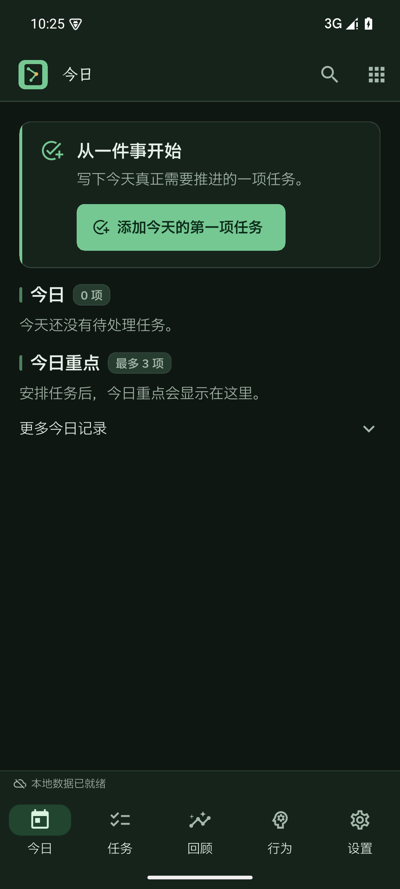

图 1  Android 今日首屏。底部五项导航分别为今日、任务、回顾、行为和设置；右上角九宫格打开更多页面。

## 2. 导航总览

### 2.1 Windows

宽屏左侧栏提供快速新增、全局搜索和全部页面入口。侧栏可折叠为图标栏；折叠只改变宽度，不隐藏页面。窗口高度较小时，侧栏内容可以滚动。

### 2.2 Android 与窄窗口

底部固定五项：今日、任务、回顾、行为、设置。右上角“更多”打开其余入口。手机横屏或可用高度不足时仍使用移动导航，避免侧栏挤压。

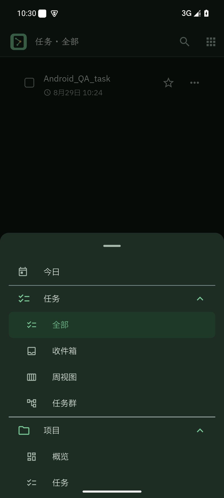

图 2  “更多”Sheet。任务、项目、专注、自律、笔记、目标和成长等入口均可从这里访问。

### 2.3 21 个实际导航目标

| 页面族 | 入口 |
| --- | --- |
| 今日 | 今日 |
| 任务 | 全部、周视图、任务群 |
| 项目与收集 | 项目、收件箱 |
| 执行 | 专注、自律 |
| 记录 | 笔记、回顾（日/周/月在页面顶部切换） |
| 成长与行为 | 目标、习惯追踪、国策树、国策库、轮次历史、高级分析、成长 |
| 系统 | 设置 |

## 3. 全局操作

### 3.1 快速新增

快速新增支持任务、笔记、今日记录和链接。先输入最小内容，再选择“完善信息”进入完整编辑器。任务标题不能为空；链接必须以 `http://` 或 `https://` 开头。保存失败时输入会保留。

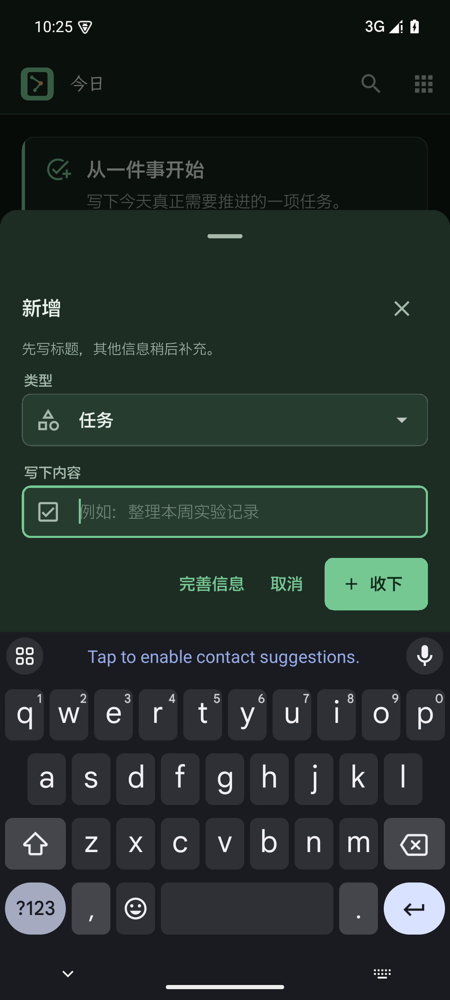

图 3  快速新增会随系统输入法调整高度。Android Back 第一次关闭输入法，第二次关闭 Sheet。

### 3.2 全局搜索

Windows 在应用窗口中按 `Ctrl+K`，或点击放大镜。可检索标题、正文和标签，并按记录类型过滤。`Escape` 关闭搜索；关闭后焦点应回到触发位置。

系统级 `Ctrl+Shift+Space` 用于 Windows 快速新增，但可能与其他软件冲突；冲突时使用侧栏按钮。

### 3.3 通用编辑器

任务、项目、里程碑、笔记、习惯、目标和链接使用同一套渐进式编辑器。常用字段先显示，日期、重复、协议、关联和标签在“更多信息”中展开。标题、日期范围、循环规则和父子关系会在保存前校验。

## 4. 今日

今日按当前逻辑日组织任务。默认逻辑日从 04:00 到次日 04:00，可在设置中调整为 00:00–06:00。修改分界只影响后续生成的周期实例，不重写历史。

页面上方的时间尺表示当前逻辑日进度：04:00 为 0%，16:00 为 50%，次日 03:59 接近 100%。填充区域和当前时间标记每分钟更新；应用回到前台时会立即刷新。

### 4.1 开始今天

创建至少一项今天的任务后点击“开始今天”。系统按优先级、安排/截止时间和创建时间选择最多三项重点。尚未产生专注或完成证据时，可以调整或更换承诺。

### 4.2 时间安排

时间块以 5 分钟为单位，可以跨午夜。重叠时显示冲突；修改或删除时间块不会删除任务。周视图和今日时间线读取同一安排。

### 4.3 结算与收尾

任务可结算为完成、失败、跳过、改期或退回收件箱。失败需要原因；改期会保留旧实例并创建关联的新实例。每日收尾会冻结事实快照并打开日回顾草稿，仍需点击“保存日回顾”。

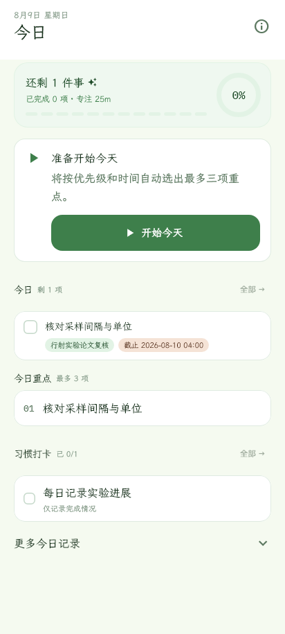

图 4  今日页面在移动宽度下保留主动作、任务、重点和记录入口。

## 5. 任务

### 5.1 全部

查看所有任务，按状态、日期、项目和任务群筛选。选择多项后可批量修改状态、日期、项目、任务群或移入回收站。批量动作遇到冲突会先确认。

每个任务卡片都会显示安排日期到截止日期、状态、优先级和循环规则；没有设置时会显示明确占位。子任务排在父任务下方并缩进，可展开或折叠；父任务不在当前筛选结果、已进入回收站或关系异常时，卡片会显示关系提示。父子任务的完成状态彼此独立。

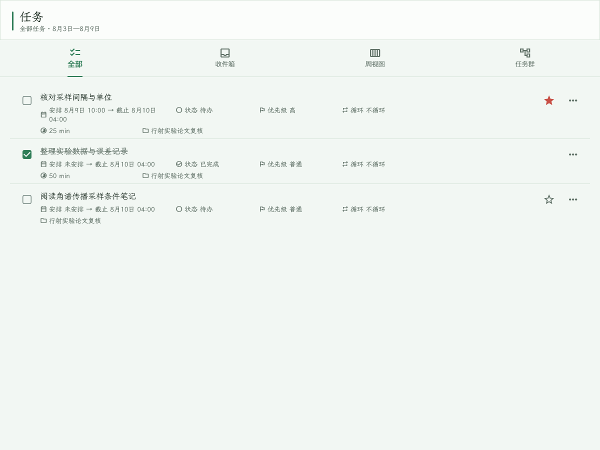

图 5  任务总览和批量操作区域。

### 5.2 收件箱

收件箱是独立入口：Windows 位于“项目”和“专注”之间，Android 位于“更多”页面中。它保存尚未安排的任务、笔记和链接，可以编辑、转换、安排或删除。Android 分享菜单发送的文本会生成“来自 Android 的收集”；网址会保存为链接，不下载网页全文。

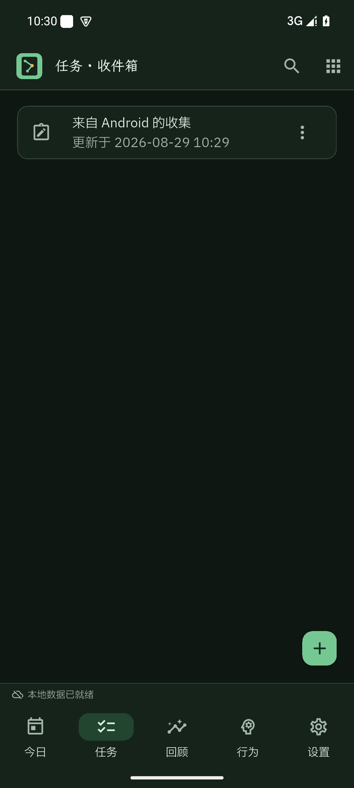

图 6  外部分享文本已进入收件箱。

### 5.3 周视图

按工作周查看 06:00 至次日 02:00 的任务与时间块。宽屏适合横向比较；窄屏改为按日阅读。拖动或编辑时间块后，冲突会立即更新。

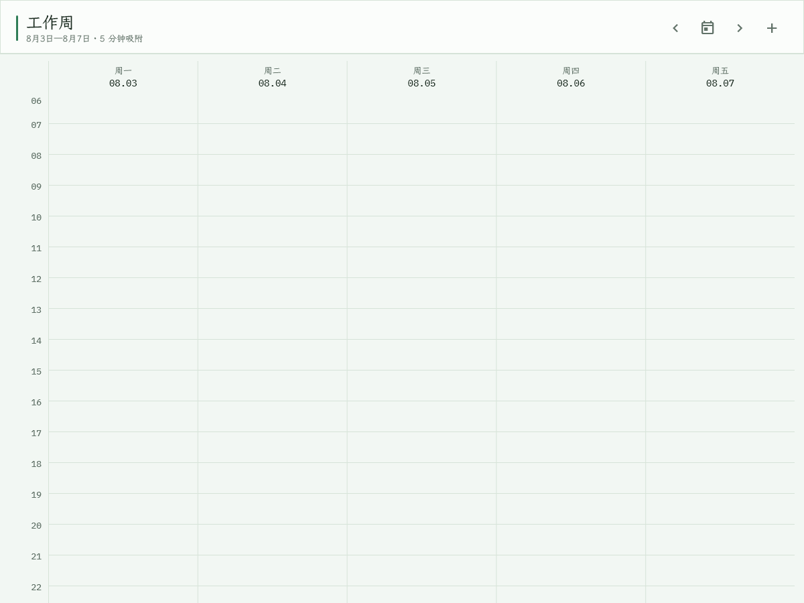

图 7  周视图显示日期、时间轴、任务块和冲突状态。

### 5.4 任务群

任务群支持并行和顺序模式。顺序任务链必须完成前置成员才能解锁下一项；调整未开始成员的顺序会记录原因。一个任务不能同时加入多个活动任务群。

## 6. 项目

项目概览就是项目主界面，不再使用多级子目录或详情 Tab。选择项目后，页面显示任务、任务群、里程碑、笔记、回顾五个可点击面板；每个面板显示数量，一次只展开一个，并可直接新增或编辑对应内容。任务面板支持清单/看板切换，笔记与回顾分别计数。

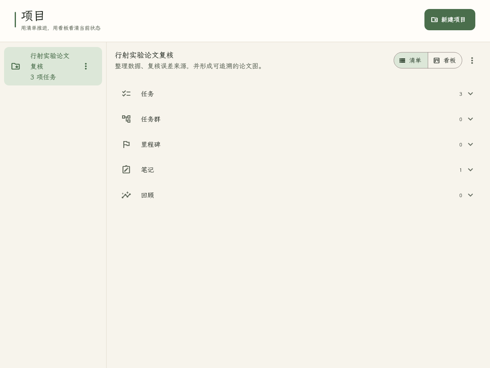

图 8  项目主从布局和五个可展开面板。

- 任务：以清单或看板方式查看项目任务，清单保留子任务层级。
- 任务群：显示主项目为当前项目的任务群；旧任务群未设置主项目时可能按成员项目推断并标注来源。
- 里程碑：创建、编辑和完成阶段结果。
- 笔记：独立查看和编辑项目笔记。
- 回顾：选择日、周或月回顾；同一周期只保留一条全局记录，并关联当前项目。

删除项目会先移入回收站。恢复后关联仍保留；永久删除应在确认备份后执行。

## 7. 专注

专注中心管理预设；会话页执行实际计时。支持正计时、25/50 分钟和自定义倒计时，可关联任务并配置休息时间。

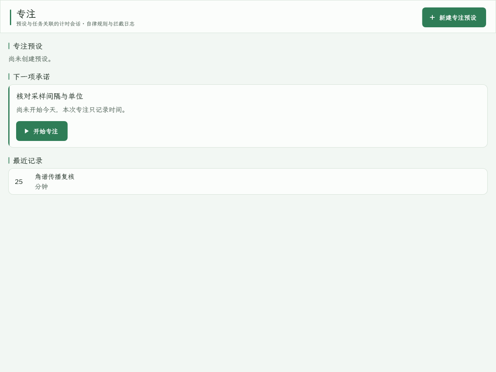

图 9  专注预设和启动入口。

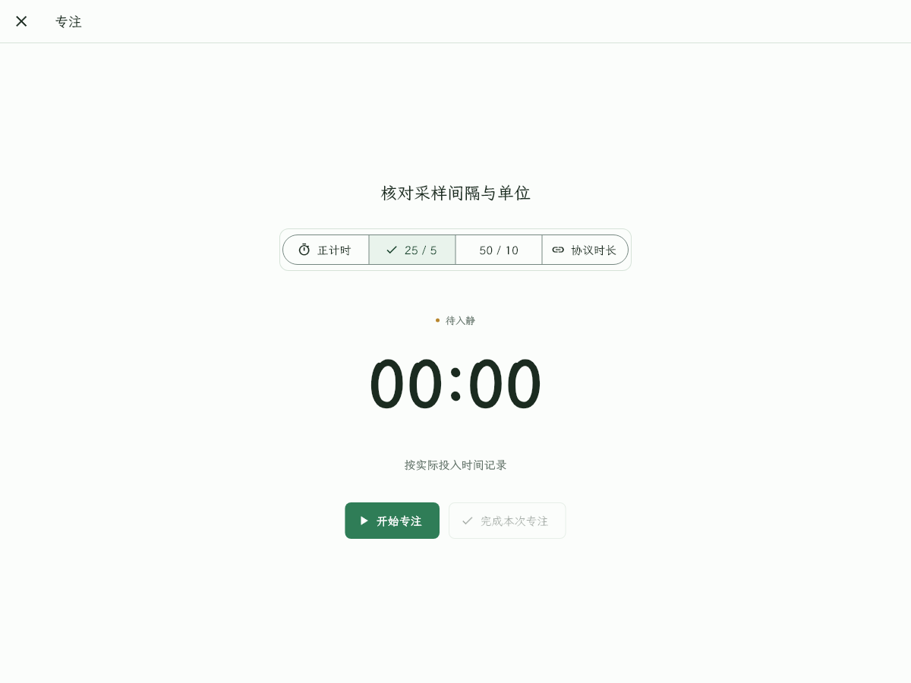

图 10  专注会话包含模式、计时、暂停/继续、完成和取消。

普通任务结算时证据可选；CTDP 任务必须写完成内容。减少动效开启后，庆祝和加载使用稳定静态终态。

## 8. 自律

自律规则可按星期、时段、应用、窗口标题和网站匹配，支持提醒或强制结束。跨午夜规则会正确归属前后逻辑日。

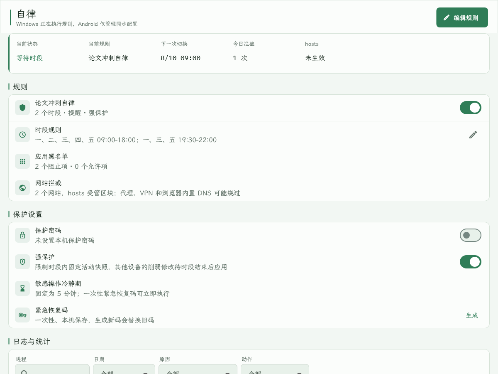

图 11  自律概览、规则状态和平台诊断。

强保护支持密码、一次性应急码和冷静期。密码不以明文保存。Windows 可提供进程与 hosts 集成；Android 只显示和同步规则，不结束进程、不修改 hosts。修改 hosts、启用开机启动或终止真实进程前，应先确认系统影响。

## 9. 笔记与附件

笔记支持 Markdown 编辑与预览、搜索/筛选、最近版本、任务/项目关联、链接和本地图片附件。关联设置使用普通 Dialog，分别列出任务和项目；只有点击“完成”才应用本次选择，取消、Escape 或关闭遮罩都会放弃尚未确认的勾选。

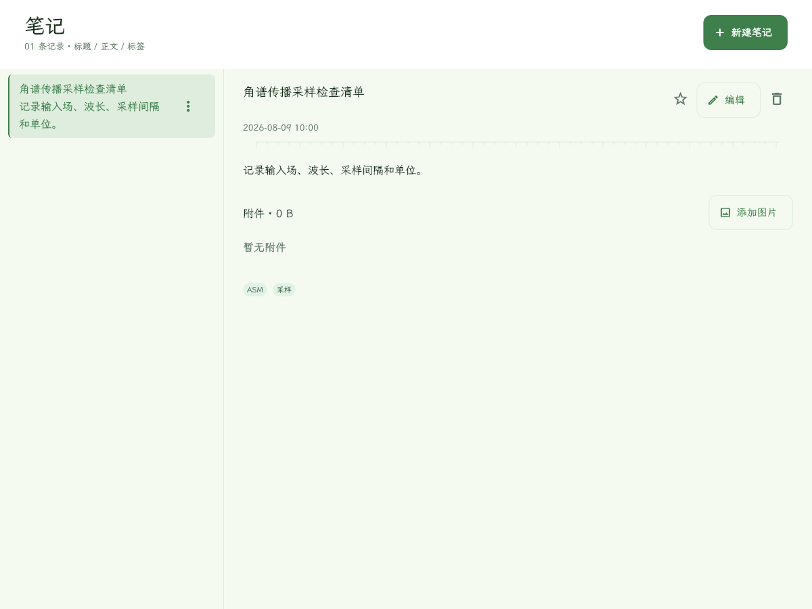

图 12  笔记索引、阅读区和编辑入口。

图片附件上限为 20 MB。应用复制附件并记录哈希；原文件缺失、不可读或超限时会显示错误，不应留下半写记录。删除笔记前先确认是否仍需要附件副本。

## 10. 回顾

回顾在同一页面顶部切换日、周和月，并持续显示当前类别和周期。系统从任务、专注、时间块和结算结果生成事实快照；保存后的快照不会随原记录自动漂移，只有点击刷新才更新。

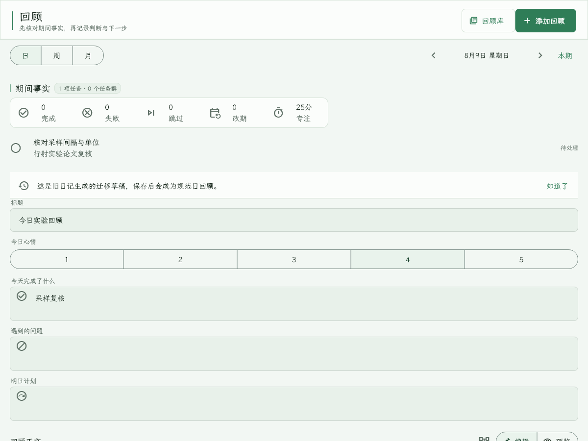

图 13  回顾周期切换、事实快照和 Markdown 输入区。

从“回顾库”点击记录会先在主区域打开只读预览，显示类型、周期、保存时间、草稿状态、正文、事实快照、附件和关联对象。只有当前日、当前周或当前月的记录显示“编辑本期”；历史记录、旧 Diary 和旧年回顾只能查看。系统禁止进入或保存未来周期。保存失败时正文保留，可修正后重试。

## 11. 目标

目标支持父子树、状态、里程碑和截止时间。系统阻止把父目标挂到自己的后代，避免循环。目标完成或删除不会自动伪造任务结果。

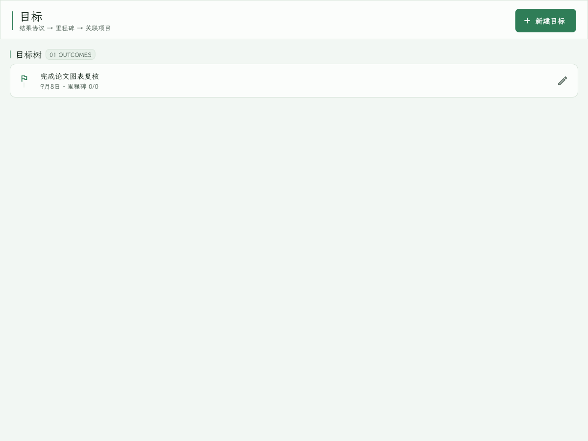

图 14  目标树与里程碑。

## 12. 行为：习惯与国策

### 12.1 习惯追踪

每个习惯使用独立卡片显示名称、层级、28 日记录和右侧“今日打卡”按钮。逻辑日以 04:00 为分界：00:00–03:59 仍属于前一天。只能修改当前逻辑日，过去日期只读且不显示未来日期；当天可在打卡与取消之间切换。RSIP 已失败或已熄灭时按钮不可操作，普通取消不会覆盖协议状态。

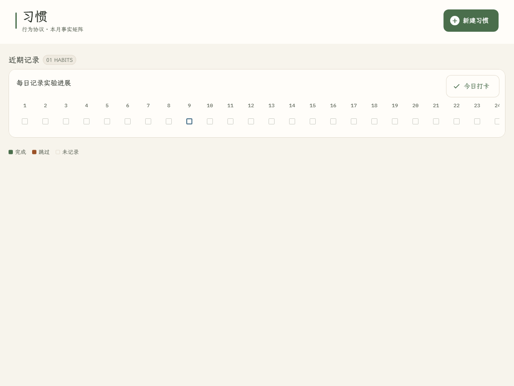

图 15  习惯列表与 28 日矩阵。

### 12.2 国策树、国策库、轮次历史和高级分析

国策支持国策、习惯、奖励、惩罚、仪式、目标、触发器和提醒八类节点。节点可拆分、计时、标记执行/违反/跳过、熄灭和恢复。违反前会显示影响预览；崩塌后的节点进入国策库。

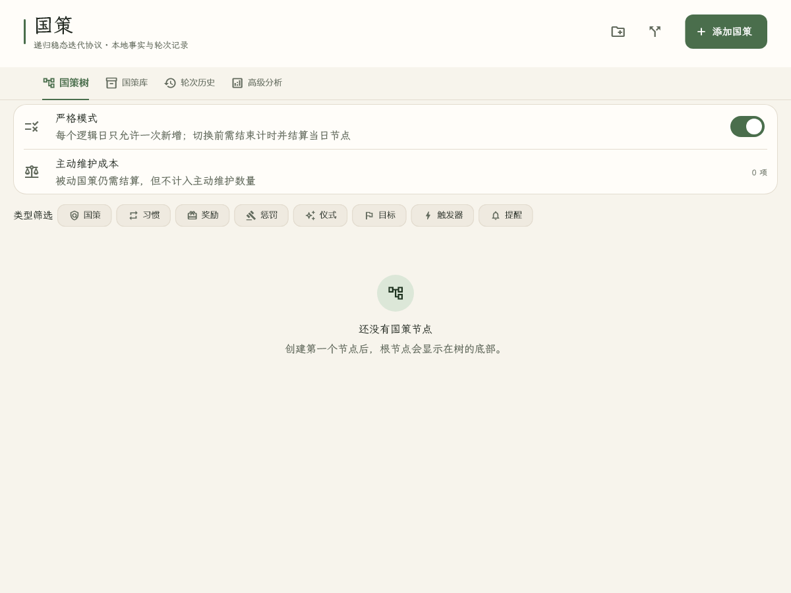

图 16  国策树和节点操作。

- 国策树：维护当前节点和父子关系。
- 国策库：查看归档并恢复到有效父节点。
- 轮次历史：查看开始、结束、持续天数和原因。
- 高级分析：按时间窗口查看规则型指标；这些指标不是医学或心理结论。

## 13. 成长

成长页显示 XP、等级、每日签到、积分、押注、证据账本、连续记录和里程碑章。签到每个逻辑日一次；押注不能超过余额，同一场只结算一次。

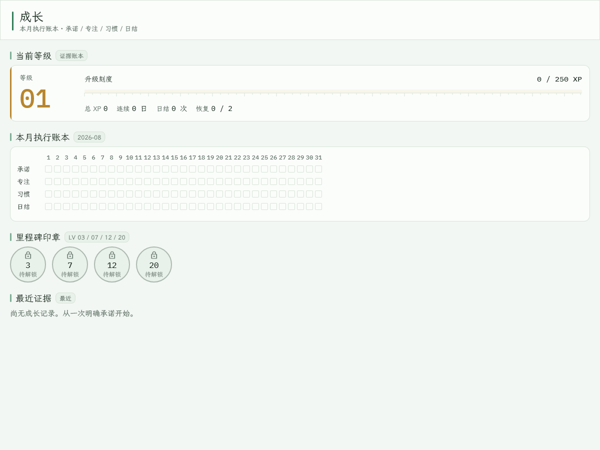

图 17  本地成长账本和状态摘要。

本地激励可以关闭展示，已有任务、笔记和回顾数据不会被删除。XP 只表达应用内行动证据，不等于科研质量或个人价值。

## 14. 设置

设置包含以下分区：

| 分区 | 主要内容 |
| --- | --- |
| 账号与同步 | 本地模式、可选 Supabase 登录与同步状态 |
| 外观与导航 | 浅色/深色/跟随系统、Windows 侧栏、个人别名 |
| 任务与周期 | 逻辑日分界 |
| 专注与检测 | 前台应用日志、定时专注显示工作台 |
| 回顾与提醒 | 日/周/月提醒时间 |
| 通知与后台 | 通知权限、托盘、开机启动、真正退出 |
| 诊断与恢复 | 管理员能力、hosts 状态、重新检查 |
| 数据与备份 | JSON 导入导出、加密备份、恢复预览、回收站 |
| 实验功能 | 高级功能、本地激励和示例内容 |

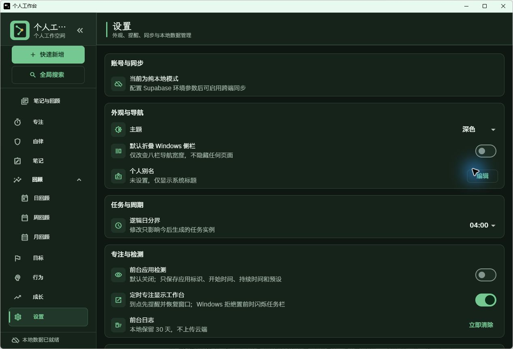

图 18  设置页深色主题。

### 14.1 Android 通知权限

点击“申请权限”后系统会显示通知对话框。拒绝时应用提供系统设置指引；再次申请可以重新出现对话框。允许后应用发送一条“通知已启用”的即时确认。

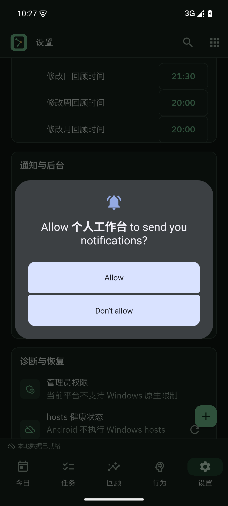

图 19  Android 15 通知权限对话框。

### 14.2 备份、导出与恢复

加密备份使用 PBKDF2-HMAC-SHA256 和 AES-256-GCM。密码至少 8 个字符。恢复前先显示备份时间和记录数量；取消不改数据，确认后原子替换记录和附件。错误密码、损坏、超限或哈希不一致会中止恢复。

JSON 导出用于可读交换，不替代加密备份。导入支持 JSON、CSV、Markdown 和 TXT；非法、过大或不可读文件会在写数据库前拒绝。

## 15. 回收站

任务、项目、笔记等先软删除到回收站。可以混合选择恢复。清空需要两步确认并永久删除；执行前建议先创建加密备份。

## 16. Windows 平台说明

- 最终构建目录必须连同 DLL 和 `data` 子目录一起保留，不能只复制 EXE。
- 关闭到托盘与真正退出含义不同：真正退出会停止计时和后台提醒。
- 开机启动、进程终止和 hosts 管理会改变当前用户或系统状态，操作前确认影响。
- `Ctrl+K` 是应用内搜索；`Ctrl+Shift+Space` 是系统级快速新增。

## 17. Android 平台说明

- 系统 Back 会先关闭输入法，再关闭 Sheet/Dialog，最后返回上一页或 Launcher。
- 外部分享文本和链接可进入收件箱。
- 通知需要 Android 13 及以上系统权限。
- Android 不执行 Windows 进程终止或 hosts 修改。
- 竖屏、横屏和窄窗口均使用自适应布局。

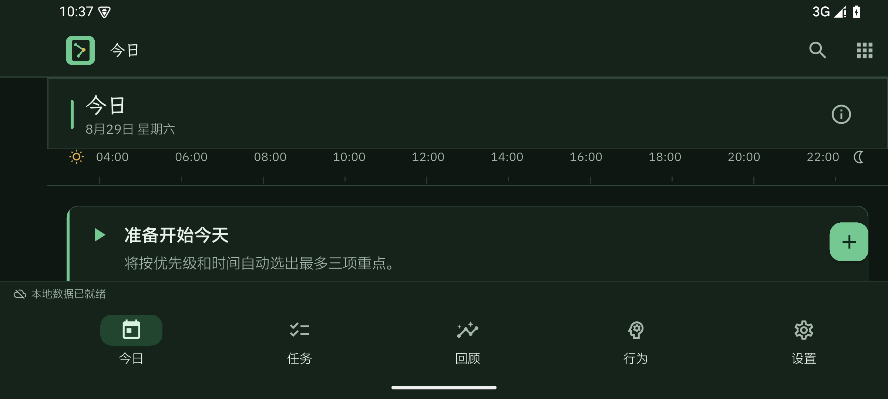

图 20  修复后的手机横屏使用五项移动导航，无侧栏溢出。

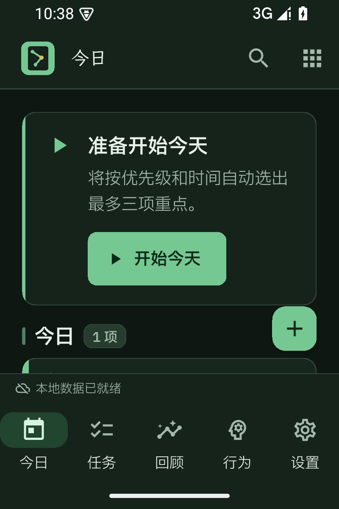

图 21  800×1200 模拟分屏尺寸下的今日页面。

## 18. 可访问性和键盘

- 使用 Tab/Shift+Tab 移动焦点，Enter/Space 激活，Escape 关闭弹层。
- 共享编辑 Dialog 打开后会取得焦点；Tab 焦点保留在弹层内，保存进行中的任务群 Dialog 不会被 Escape 提前关闭。
- 桌面导航分组支持左右箭头展开和折叠。
- 图标按钮提供 Tooltip 或语义名称。
- 主要移动触控目标至少 48dp。
- 200% 文字缩放时页面允许换行或滚动，不依赖缩小字体。
- 开启系统减少动效后，功能和终态保持完整。

## 19. 常见问题

### 应用启动后没有数据

先确认状态栏显示“本地数据已就绪”。新安装默认是空数据库；从今日添加第一项任务即可。不要手动复制正在使用的 SQLite 文件。

### 通知没有出现

在设置中申请权限，并检查系统通知设置。Android 厂商后台策略可能延迟长期提醒；Windows 真正退出后不承诺后台提醒。

### 无法恢复备份

确认密码、文件大小和文件来源。不要修改 `.pwb` 文件内容。恢复失败不会部分覆盖现有数据库。

### 云同步不可用

未配置 Supabase 时应用保持纯本地模式。不要把服务端密钥写入应用；只使用公开客户端配置，并确保服务端 RLS 已启用。

### 中文路径导致构建失败

开发者使用 `tool/build_windows.ps1` 或 `tool/build_android.ps1`。脚本在 ASCII 缓存镜像中构建，再把产物复制回标准目录。

## 20. 数据安全清单

1. 第一次正式录入前创建加密备份。
2. 卸载、清空回收站或恢复旧备份前再次备份。
3. 不把原始实验数据目录当作附件工作目录。
4. 不提交数据库、备份、密钥、账号或未公开实验数据。
5. 记录任务和笔记中的波长、像素尺寸、采样间隔、单位和坐标系；应用不会替你猜测科研参数。
