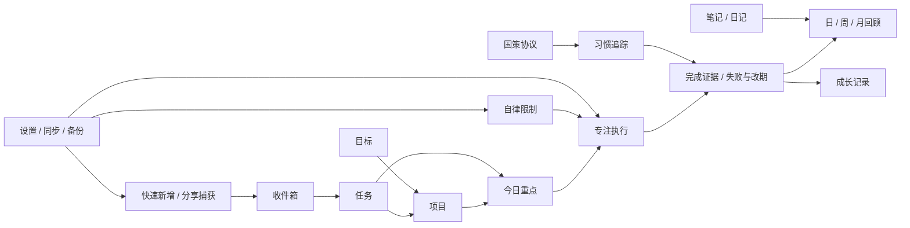

# 个人工作台 Stitch 重设计交接文档

> 文档范围：基于当前 Flutter 仓库、现有产品文档、页面源码、组件实现与测试截图进行逆向分析。本文只定义设计与交接要求，不修改业务逻辑，也不假设尚未实现的能力。

# Product Overview

“个人工作台”是一款面向单个中文用户的本地优先个人管理应用。它把快速收集、任务与项目规划、今日承诺、专注执行、知识与日记、目标与习惯、周期回顾、自律限制和成长证据组织在同一个工作流中。

- 主要平台：Windows 桌面端与 Android 移动端。
- 技术形态：Flutter 自适应应用；SQLite 本地存储；Supabase 为可选同步层。
- 核心心智模型：从“捕获”进入“计划”，从“今日承诺”进入“专注执行”，最后通过“回顾、习惯与成长记录”形成闭环。
- 当前视觉隐喻：“个人航行日志”。界面使用纸张般的浅色底、墨绿色路径色、黄铜色完成标记和克制的红色风险提示。
- 产品边界：不是团队协作系统，不含 AI 代理，不是完整文件同步盘，也不接入第三方日历。

# Product Goals

1. 让用户在 Windows 上完成完整规划、编辑、执行与复盘，同时在 Android 上快速捕获、查看今日事项和记录行为。
2. 在功能密度较高的前提下，让“现在应该做什么”始终比“系统有哪些功能”更突出。
3. 保留本地优先、可恢复、可追溯的工作方式，不让同步、游戏化或高级协议干扰基础流程。
4. 通过真实完成记录、专注记录、习惯记录和回顾构建成长证据，而非用装饰性数据制造成就感。
5. 让重设计结果能在现有 Flutter 页面、路由和控制器契约上渐进落地。

# Target Users

核心用户是同时使用 Windows 与 Android 的个人知识工作者或研究生：任务来源多、时间跨度长，既需要快速捕获，也需要项目拆解、长时专注、实验或写作记录和周期复盘。

典型需求：

- 在不打断当前工作的情况下收下一个想法、链接或任务。
- 从项目、截止日期和周计划中选出不超过三项“今日重点”。
- 开始专注并记录完成证据、失败原因或改期原因。
- 查看习惯、协议、目标和成长记录，但不希望这些高级机制压过日常任务。
- 在本地保存敏感工作资料；需要时再选择登录和同步。
- 依赖键盘完成桌面高频操作，也要求移动端具备可靠的返回、触控和安全区行为。

# Current Information Architecture

## 当前桌面导航

- 今日
- 任务
  - 全部
  - 收件箱
  - 周视图
  - 任务群
- 项目
  - 概览
  - 任务
  - 任务群
  - 里程碑
  - 笔记与回顾
- 专注
- 自律
- 笔记
- 回顾
  - 日回顾
  - 周回顾
  - 月回顾
- 目标
- 行为
  - 习惯追踪
  - 国策协议
    - 国策树
    - 国策库
    - 轮次历史
    - 高级分析
- 成长
- 设置

桌面侧栏宽度为展开 `236 px`、折叠 `80 px`，顶部固定提供“快速新增”和“全局搜索”，底部显示同步状态。移动端使用五项底部导航：今日、任务、回顾、行为、设置；其余入口进入“更多”导航面板。

## 导航评估

当前路由覆盖完整，且已适配桌面与移动端；问题不在“缺页面”，而在顶层同级入口较多、任务/项目/行为内部还存在二至三级导航。重设计应保留所有路由和控制器调用，通过分组、二级导航和渐进披露减少记忆负担，不能删除或合并真实能力。

# Screen Inventory

| 优先级 | 页面 / 界面 | 入口与平台 | 主要任务 | 关键状态 |
|---|---|---|---|---|
| P0 | 应用壳层与导航 | Windows / Android | 在模块间切换、查看同步状态 | 展开、折叠、选中、同步中、同步失败、移动端更多面板 |
| P0 | 今日 | 默认首页 | 查看下一步、三项重点、结算任务、开始专注 | 未开始、进行中、逾期、已完成、失败、跳过、改期、空状态、日结关闭 |
| P0 | 任务：全部 | 任务 > 全部 | 浏览、筛选、批量管理任务 | 普通、展开、选中、批量处理中、部分失败、空状态 |
| P0 | 收件箱 | 任务 > 收件箱 | 处理快速捕获记录 | 未整理、编辑、删除、空状态 |
| P0 | 周视图 | 任务 > 周视图 | 创建和调整时间块 | 冲突、当前时间、编辑、新建、空日期 |
| P0 | 快速新增 | 侧栏 / FAB / 分享 | 创建任务、笔记、日记或链接 | 默认、类型切换、校验错误、提交中、失败保留内容 |
| P0 | 全局搜索 | 侧栏 / `Ctrl+K` | 搜索并打开记录 | 初始、输入中、加载、无结果、结果高亮、错误 |
| P0 | 专注中心与专注会话 | 专注 / 今日任务 | 选择预设并执行专注 | 倒计时、正计时、暂停、完成、被打断、待确认计划、恢复 |
| P0 | 设置 | 设置 | 管理同步、外观、周期、通知、数据与实验功能 | 本地模式、登录、同步中/错、权限不足、危险确认、回收站空状态 |
| P1 | 项目工作区 | 项目 | 管理项目、任务、任务群、里程碑、笔记与回顾 | 无项目、选中项目、列表/看板、拖拽、软删除 |
| P1 | 自律 | 自律 | 配置 Windows 限制规则并查看执行状态 | 未启用、等待时段、限制中、临时休息、冷却、UAC/hosts 异常 |
| P1 | 笔记 | 笔记 | 浏览、编辑 Markdown、管理附件与关系 | 未选中、编辑、预览、附件加载/失败、空状态 |
| P1 | 回顾 | 回顾 | 核对事实并写日/周/月回顾 | 草稿、完成、跳过、数据变化、旧日记迁移、历史筛选 |
| P1 | 行为：习惯追踪 | 行为 | 记录 28 天习惯执行 | 完成、跳过、未记录、父子层级、RSIP 状态、空状态 |
| P1 | 行为：国策协议 | 行为 | 管理规则树、轮次与分析 | 严格模式、类型筛选、执行、违反、跳过、归档、分析免责声明 |
| P1 | 目标 | 目标 | 管理目标树、里程碑和项目关联 | 展开/折叠、进行中、完成、到期、空状态 |
| P2 | 任务群 | 任务 / 项目 | 管理串行、并行任务群 | 锁定、移动、移除、跳过、进行中 |
| P2 | 日记 | 独立兼容页面 / 回顾迁移 | 记录心情、完成、问题与明日计划 | 日期选择、保存、搜索、空状态、待迁移 |
| P2 | 成长 | 成长 | 查看 XP、连续记录、恢复和本地激励 | 游戏功能关闭/开启、签到、下注、恢复、无证据 |
| P2 | 高级协议 | 兼容/实验入口 | 管理 CTDP、RSIP、判例与分析 | 目标、习惯、执行协议、判例、分析、实验功能关闭 |
| P3 | 移动端更多 | 移动壳层 | 访问底栏外页面 | 默认、当前页选中、不可用/平台限定 |
| P3 | 兼容路由 | 内部映射 | 保持旧入口可用 | `plan`、`protocols`、`calendar` 等别名映射 |

说明：仓库没有独立“关于”页面；版本号目前位于设置页底部。不得在 Stitch 方案中虚构独立页面或团队、AI、第三方日历功能。

# User Flows

## 流程 A：捕获到执行

1. 用户从侧栏、FAB 或 Android 分享入口打开快速新增。
2. 选择任务、笔记、日记或链接并输入最少必要信息。
3. 未完善的记录进入收件箱；任务可继续补充项目、日期、优先级和协议字段。
4. 用户在任务或项目中规划，并把最多三项任务纳入今日重点。
5. 从“接下来”或任务行开始专注，完成后记录文本、链接或图片证据。
6. 将任务结算为完成、失败、跳过或改期；失败和替换重点需要原因。

## 流程 B：项目规划到周视图

1. 创建项目并关联目标。
2. 在项目详情的任务、任务群、里程碑中拆解工作。
3. 在列表或三列看板中调整任务状态。
4. 在周视图建立时间块；系统以红色和文本提示冲突。
5. 回到今日页查看与当前日期相关的承诺和下一步。

## 流程 C：记录到回顾

1. 日常产生任务结算、专注、习惯、笔记和日记记录。
2. 打开日、周或月回顾，先检查期间事实快照。
3. 如果统计发生变化，明确刷新，而非静默覆盖已写内容。
4. 写 Markdown 回顾，关联记录和附件，保存草稿、跳过或完成。
5. 成长页只展示来自真实记录的 XP、连续性与里程碑。

## 流程 D：自律规则

1. Windows 用户创建规则，选择黑名单/白名单、默认动作、时段、进程、标题关键词和网站。
2. 开启规则后查看当前状态、下一次切换、拦截次数和 hosts 健康。
3. 强保护、休息、冷却、紧急恢复码和系统权限都使用显式状态与确认。
4. Android 仅编辑和同步规则，不声称能终止 Windows 进程或修改 hosts。

# Existing Design System

## 品牌与色彩

| 语义 | Light | Dark | 用法 |
|---|---:|---:|---|
| Canvas | `#F2F7F3` | `#0F1712` | 页面底色 |
| Surface | `#FBFDFB` | `#16231B` | 实体面板、菜单与对话框 |
| Ink | `#1B2B20` | `#E8F2EA` | 主文本与图标 |
| Route | `#2F7D57` | `#76C893` | 主操作、路径与焦点 |
| Signal | `#C84F45` | `#F07A6F` | 错误、冲突与危险动作 |
| Marker | `#B8862D` | `#DDB65B` | 完成印记、里程碑和证据 |

原则：不能仅靠颜色传递状态；冲突、失败、完成和警告必须同时有文本、图标或形状编码。需在最终设计稿中逐一测量实际前景/背景组合，正文目标至少 `4.5:1`。

## 字体与层级

- 页面标题：`LXGW WenKai GB`，用于航行日志式标题，不用于长正文或紧凑控件。
- 正文、表单、控件：`IBM Plex Sans SC`。
- 时间、XP、倒计时、参数：`IBM Plex Mono`，使用 tabular figures。
- 当前字号：页面大标题 `28/1.3`，章节标题 `22/1.35`，卡片标题 `18/1.4`，控件标题 `16/1.375`，正文 `15/1.5`，辅助文本 `13/1.35`，小标签 `12/1.3`。

## 间距、圆角与尺寸

- 间距标尺：`4 / 8 / 12 / 16 / 24 / 32 px`。
- 页面边距：紧凑 `16 px`，中等 `20 px`，宽屏 `24 px`。
- 圆角：面板 `6 px`，控件 `4 px`，对话框和底部面板 `8 px`。
- 图标：`16 / 20 / 24 / 32 px`。
- 桌面控件高度：约 `36 px`；Android 触控目标：至少 `48 dp`。
- 桌面任务行约 `44 px`；移动任务行约 `52 px`。

## 动效

- 微交互：`120 ms`。
- 状态变化：`180 ms`。
- 退出：`150 ms`。
- 页面/强调过渡：`220 ms`。
- 序列进入间隔：`20 ms`。
- 支持减少动态效果；首屏不得以大面积入场动画延迟读取。

## 已有组件语言

- `PageHeader`：实体面板、左侧 `3 px` 绿色竖线、标题/副标题/操作区。
- `SectionHeading`：小型路径竖线、标题、计数或尾部操作。
- `SolidPanel` / `LogSurface`：实体表面、细边框、轻阴影；选中时为主色边框和左侧指示条。
- `LogRail`：只表达真实时间、顺序或证据，包含 pending/current/completed/warning 文本语义。
- `StatusPill`、`SurfaceIcon`、`EmptyState`、`SkeletonBlock`、`AnimatedNumber`。
- 自定义“印记”Logo、墨水涟漪加载、标签和状态印章。
- 统一对话框为淡入加 `0.96 -> 1` 缩放；移动端长表单使用全屏或底部面板。

# UI / UX Audit

## 做得好的部分

- 产品流程与路由较完整，桌面和移动端职责区分明确。
- 今日页把“接下来、今日重点、任务结算、成长证据”放在同一工作上下文中。
- 快速新增和全局搜索是跨页面持久入口，支持桌面键盘高频操作。
- 实体表面、克制圆角和日志轨道形成了与“个人航行日志”一致的辨识度。
- 代码中已有 Semantics、live region、键盘焦点、Android 返回和不只依赖颜色的状态表达。
- 危险操作、备份恢复、规则冷却和回收站已有明确确认路径。

## 主要问题

1. 顶层导航项目多，任务、项目、行为又各有深层分支；用户需要记忆功能所属位置。
2. 设置页把账户、外观、周期、专注、通知、诊断、备份、实验功能和回收站放在一个长滚动面，查找成本最高。
3. 今日页在宽屏同时显示时间轴、下一步、多组任务、重点和成长，信息价值明确但视觉竞争较强。
4. 任务行既承载状态、元信息、协议、子任务和菜单；批量模式再叠加工具条，首次理解成本偏高。
5. 项目页同时存在左侧项目列表、项目内标签页、列表/看板切换和任务菜单，导航层级容易混淆。
6. CTDP、RSIP、hosts、UAC、Supabase 等术语对非高级用户不够自解释，应放入“高级”上下文并提供简短解释。
7. 国策树、28 天习惯矩阵和看板拖拽是高密度自定义界面，仍需人工验证键盘、读屏、缩放和 200% 文本。
8. 一些页面存在多个相似的有边框区块，容易出现“卡片套卡片”和均匀强调，削弱阅读层级。

# Design Problems

| 问题 | 用户影响 | 严重度 | 设计处理 |
|---|---|---:|---|
| 导航入口密集、分组心智不统一 | 寻找功能慢，新用户不知道从哪里开始 | 高 | 按工作目标分组，保留原路由；给复杂模块稳定二级导航 |
| 设置为超长单列 | 状态与操作难定位，危险操作容易混入普通设置 | 高 | 桌面设置索引 + 内容区；移动端分层列表；危险区独立 |
| 今日页模块竞争 | “下一步”与低频信息争夺注意力 | 高 | 固定优先级：下一步 > 今日重点 > 时间与任务 > 证据摘要 |
| 复杂行项目操作过多 | 扫描困难、误触概率增加 | 中高 | 行内仅保留状态和一个主操作，其余进菜单或展开区 |
| 项目内导航叠层 | 用户难以确认当前项目与当前视图 | 中高 | 项目上下文标题固定；项目二级标签与视图切换分层 |
| 高级协议术语裸露 | 基础用户产生理解负担 | 中 | 实验功能关闭时隐藏高级入口；首次出现给短定义 |
| 平台能力差异不够前置 | Android 用户可能误解自律执行能力 | 高 | 在自律页顶部固定平台能力说明与当前执行设备 |
| 自定义可视化无完整人工无障碍证据 | 键盘和读屏用户可能无法操作 | 中高 | 提供表格/列表替代、键盘路径、焦点恢复和读屏验收清单 |

# Design Principles

1. **下一步优先**：每个页面先回答用户在当前上下文中最可能采取的动作。
2. **真实证据，不做装饰**：时间轴、日志、进度和印章必须对应真实数据或状态。
3. **基础流程默认，高级能力渐进**：CTDP、RSIP、国策分析和本地激励不压过任务、专注与回顾。
4. **实体、清晰、克制**：不使用玻璃拟态、渐变光斑、夸张阴影或大量悬浮卡片。
5. **跨平台同语义、不同布局**：Windows 提供密集规划和键盘效率；Android 提供单列、触控和快速记录。
6. **危险状态明确**：数据替换、永久删除、强保护和系统权限操作采用独立危险层级。
7. **为真实数据密度设计**：标题、标签、附件、项目名和错误信息都按长内容验证，不依赖理想化短文案。

# Target Visual Direction

建议方向名：**“有序航行台”**。

保留“个人航行日志”的墨绿、纸面和黄铜印记，但把它从装饰隐喻收束为系统化的信息表达：墨绿表示当前路径与可执行动作，黄铜表示已验证的完成证据，红色只表示冲突、阻止和不可逆风险。界面应像安静、可靠的个人操作台，而不是营销仪表盘或游戏化面板。

视觉关键词：安静、精确、可追溯、纸面、墨迹、路径、航行日志、研究工作台、紧凑而不拥挤、实体表面、清晰焦点、中文优先。

# New Design System Proposal

## Token 策略

保留当前品牌 token，不更改语义；新增的是命名清晰度和组件应用规则：

- `bg.canvas`、`bg.surface`、`bg.subtle`、`bg.raised`。
- `text.primary`、`text.secondary`、`text.muted`、`text.inverse`。
- `action.primary` 使用 Route；`status.success/evidence` 使用 Marker；`status.danger/conflict` 使用 Signal。
- 边框分为 `border.subtle`、`border.strong`、`border.focus`，避免每个区块都用同等边框。
- 阴影只区分 `surface`、`overlay` 两级；普通页面区块优先靠留白和分隔线分组。

## 版式

- 页面标题只使用一个 `H1`；页面内主区块使用 `H2`，紧凑面板用 `H3`。
- 关键数值采用等宽数字，但解释文字仍用正文体。
- 长标题最多两行；行项目中使用省略和可访问 tooltip，详情区展示完整值。
- 不随视口宽度连续缩放字号；只在断点切换布局与密度。

## 组件层级

- 页面区块默认无外层卡片；单个可交互实体、工具面板、弹窗、重复项目才使用卡片。
- 卡片内不再嵌套视觉完整的卡片。子内容使用分隔线、缩进、浅底或 disclosure。
- 主操作每个上下文只保留一个；次操作使用描边或菜单。
- 状态 pill 用于短状态，不承载完整说明；需要解释时在相邻文本区展开。
- 桌面密集表格/列表提供 hover、选中、焦点三个独立状态，不能互相替代。

# Navigation Proposal

## 推荐桌面分组

保持现有 `WorkbenchSection` 路由不变，只调整呈现分组：

- **工作台**：今日、收件箱、专注
- **计划**：任务、周视图、任务群、项目、目标
- **记录**：笔记、回顾
- **行为**：习惯、国策协议、成长
- **系统**：自律、设置

交互要求：

- 快速新增和全局搜索继续固定在导航顶部。
- 折叠侧栏只显示熟悉图标，hover/focus 显示完整名称；分组标题不可占用窄栏。
- 当前路径同时在侧栏选中态和页面上下文标题中可见。
- 任务、项目、回顾、行为、设置使用稳定二级导航，不把所有子页同时塞入主侧栏。
- 兼容路由继续映射，但不新增重复可见入口。

## 推荐移动导航

保留今日、任务、回顾、行为、设置五项底栏。专注由今日和任务上下文进入，同时在“更多”中保留直接入口；项目、目标、笔记、成长、自律放入可搜索的更多面板。不要为移动端复制桌面三级树。

# Page Layout Proposal

## 桌面框架

- `>= 1200 px`：`236 px` 主导航 + 弹性主内容 + 可选 `280–320 px` 上下文/证据栏。
- `768–1199 px`：`80 px` 折叠主导航 + 单主内容；右侧栏折叠为页面内 disclosure 或抽屉。
- 主内容最大阅读宽度按页面类型设置：编辑阅读页约 `880–1040 px`；时间表、看板、矩阵允许占满可用宽度。
- 页面标题、筛选工具条和内容滚动层级必须稳定，避免多个嵌套滚动区。

## 页面模板

- **执行模板**：今日、专注、自律。顶部状态与主操作，主体为实时工作区，侧栏为证据与历史。
- **管理模板**：任务、项目、目标、行为。顶部范围/筛选，主体为列表/树/看板，详情按需展开。
- **阅读编辑模板**：笔记、回顾、日记。桌面双栏，移动端列表与详情分步导航。
- **设置模板**：桌面二级索引 + 内容区；移动端设置分组列表 -> 独立详情页。

# Component Guidelines

| 组件 | 规范 |
|---|---|
| Page Header | 标题、简短上下文、最多一个主按钮；状态信息不要全部挤入标题行 |
| Task Row | 左侧状态，中央标题与最多两项关键元信息，右侧一个上下文主操作和更多菜单；展开后显示协议与证据 |
| Batch Toolbar | 仅在选择后出现；固定显示数量、撤销选择和高频批量操作；执行中锁定重复提交并报告部分失败 |
| Filter Bar | 桌面单行、移动端可横向滚动或打开筛选面板；始终显示已应用条件数量和清除入口 |
| Empty State | 说明当前范围为何为空，并提供一个最合适动作；不放产品功能介绍 |
| Error State | 错误发生位置、影响和可恢复动作；保留用户输入 |
| Dialog / Sheet | 桌面短表单用对话框，移动端长表单全屏；关闭后焦点返回触发元素 |
| Status Pill | 图标 + 文本 + 语义色；不得只用红绿区分 |
| Timeline / Log Rail | 仅用于真实顺序、时间或证据；提供列表语义和纯文本替代 |
| Tree / Matrix / Board | 提供键盘移动、选中说明、列表或表格替代；拖拽不是唯一操作方式 |
| Destructive Zone | 永久删除、覆盖恢复、强保护与系统级动作使用独立红色区域和二次确认 |

# Interaction States

每个可交互组件必须覆盖：

- `default`：默认状态。
- `hover`：仅指针设备，不能改变布局尺寸。
- `focus-visible`：`2 px` 清晰焦点环，与 hover 独立。
- `pressed`：允许轻微 `0.96` 缩放，不能引起布局位移。
- `selected/current`：背景、边框/指示条和文本同时表达。
- `disabled`：降低强调但保持文字可读，并说明不可用原因。
- `loading`：局部骨架或进度；避免整页闪烁。
- `empty`：说明范围和下一步。
- `success`：短暂反馈并更新真实状态。
- `warning`：可继续但有后果，例如统计已变化。
- `error`：就地说明、可重试、保留输入。
- `offline/sync conflict`：区分本地已保存、待同步、同步失败和冲突副本。

# Accessibility

- 正文实际对比度目标至少 `4.5:1`，大文本至少 `3:1`；焦点、边框和非文本控件至少 `3:1`。
- Android 触控目标至少 `48 x 48 dp`；桌面图标按钮至少提供可见 tooltip 和语义名称。
- 保留 `Ctrl+K`、选择模式、方向键展开和 Android 系统返回；不得用 hover 才能发现核心操作。
- 弹窗、底部面板和全屏编辑器需要焦点圈定、初始焦点、关闭后焦点恢复和 Escape/系统返回行为。
- 状态变化、批量结果、搜索结果数量和错误使用 live region，但避免重复播报。
- 时间冲突、习惯状态、任务状态和国策类型均使用图标/文本/形状，不依赖颜色。
- 支持系统字体缩放；在 `390 px` 宽和 200% 文本下，按钮文字允许换行且不得遮挡相邻内容。
- 国策树、看板拖拽、时间表和 28 天矩阵必须提供等价的键盘操作及列表/表格视图。
- 需人工完成 NVDA、TalkBack、键盘全流程和高对比度模式验证；现有自动测试不能替代这些检查。

# Responsive Strategy

| 断点 | 导航 | 内容 | 交互 |
|---|---|---|---|
| `< 768 px` | 五项底栏 + 更多面板 | 单列；列表与详情分步 | 48 dp 触控；长表单全屏；系统返回 |
| `768–1199 px` | 80 px 图标侧栏 | 主内容单栏；上下文栏变抽屉 | 支持键鼠与触控；避免三栏挤压 |
| `>= 1200 px` | 236 px 展开侧栏 | 主内容 + 可选证据栏 | 高密度列表、快捷键、批量模式 |

特例：周视图、看板、国策树和习惯矩阵不能简单等比缩小。移动端分别切换为日列表、状态分段列表、分层列表和按周/日期分段的可滚动表格。

# Recommended Redesign Strategy

推荐方案：**方案 A，分组工作台 + 稳定二级导航**。

选择理由：

- 不改变现有业务路由、数据模型和控制器契约，行为回归风险最低。
- 通过顶层分组和复杂模块二级导航即可显著降低认知负担，收益高于全面改造交互范式。
- 与 Windows 规划、Android 快速操作的既有平台分工一致。
- 能逐页实施：先壳层、今日、任务和设置，再推进项目、行为与回顾，不要求一次重写。
- 保留“个人航行日志”辨识度，同时解决卡片均匀强调和设置长滚动问题。

建议实施顺序：P0 壳层/今日/任务/专注/设置 -> P1 项目/自律/笔记/回顾/行为/目标 -> P2 高级协议与成长。每一步都以现有 Golden 和功能测试为行为基线。

# Alternative Design Options

## 方案 A：分组工作台 + 稳定二级导航（推荐）

- 核心：精简主导航视觉层级，把深层子页移入页面内稳定二级导航。
- 优点：行为变化小、迁移可分阶段、跨平台一致性最好。
- 代价：仍保留较多专业功能，需要持续做好渐进披露。
- 适合：当前产品阶段和单用户研究工作流。

## 方案 B：紧凑指令台

- 核心：以全局搜索、命令面板、密集表格和键盘操作为主，侧栏只保留少量模块。
- 优点：Windows 熟练用户效率高，适合大量记录和批量处理。
- 代价：学习成本高；Android 与桌面范式差异变大；可发现性与无障碍风险增加。
- 实施成本：中高，需要统一命令、快捷键、选择与撤销模型。

## 方案 C：阅读与执行双模式

- 核心：把计划/阅读与今日/专注拆为两个强模式，通过全局模式切换进入不同壳层。
- 优点：执行时干扰最少，情境切换明确。
- 代价：同一记录跨模式出现，用户需要理解两个空间；现有路由与返回栈改动大。
- 实施成本与风险：高，不建议作为本轮 Stitch 目标。

# Page-by-Page Stitch Prompts

完整的 P0/P1 页面提示词位于 [STITCH_PAGE_PROMPTS.md](./STITCH_PAGE_PROMPTS.md)。该文件覆盖：

- 应用壳层与响应式导航
- 今日
- 任务（全部、收件箱、周视图、任务群）
- 快速新增与全局搜索
- 项目
- 专注中心与专注会话
- 自律
- 笔记
- 回顾
- 行为（习惯与国策协议）
- 目标
- 设置

每条 prompt 均包含 `Page / Purpose / Existing Functionality / Layout / Components / Content / Interaction / Visual Style / States / Constraints / Improvements`，并明确不得删除功能或虚构后端能力。

# MASTER STITCH PROMPT

可直接粘贴到 Stitch 的完整总提示词位于 [STITCH_MASTER_PROMPT.md](./STITCH_MASTER_PROMPT.md)。它定义了产品定位、用户、信息架构、品牌 token、组件、交互、无障碍、桌面/移动适配与实现约束。

# Stitch Design Keywords

`personal productivity cockpit`、`research workbench`、`Chinese-first UI`、`quiet operational interface`、`paper-like solid surfaces`、`ink green navigation`、`brass evidence markers`、`dense but breathable`、`timeline evidence`、`local-first`、`keyboard efficient`、`accessible data visualization`、`Windows desktop productivity`、`Android quick capture`、`clear destructive states`、`progressive disclosure`。

# Stitch Avoid List

- 不要使用玻璃拟态、`BackdropFilter`、透明毛玻璃或霓虹光晕。
- 不要使用紫蓝渐变、米黄单色主题、装饰性渐变球或 bokeh。
- 不要把页面每个区块都做成悬浮卡片，也不要卡片套卡片。
- 不要做营销首页、巨大 hero、空泛功能介绍或虚构统计图。
- 不要用超大字号占据工作界面，也不要随视口宽度连续缩放字体。
- 不要只用红/绿、颜色深浅或微妙阴影表示状态。
- 不要隐藏主操作在 hover、手势或无标签图标中。
- 不要删除现有页面、字段、平台状态、错误态或危险确认。
- 不要新增团队协作、AI 助手、第三方日历、完整云盘或不存在的后端能力。
- 不要把 Android 自律描述为能直接执行 Windows 系统限制。
- 不要用游戏化装饰替代真实成长证据。
- 不要把 CTDP、RSIP、hosts、UAC 等缩写当作无须解释的基础术语。

# Implementation Constraints

1. 保留所有 `WorkbenchSection` 路由、兼容别名、控制器方法和现有数据语义。
2. Flutter Material 3 自适应实现；不引入新的大型 UI 依赖。
3. SQLite 是本地事实来源；Supabase 同步是可选能力。必须表达本地已保存、待同步、同步失败和冲突副本。
4. 不覆盖或弱化备份、恢复预览、回收站、永久删除二次确认和附件处理。
5. Windows 才执行进程、hosts、托盘、启动项和 UAC 相关能力；Android 仅编辑和同步相关规则。
6. 快速新增失败时保留内容；回顾统计变化不静默覆盖；专注中断和任务结算保留原因/证据。
7. 继续使用现有离线字体：`LXGW WenKai GB`、`IBM Plex Sans SC`、`IBM Plex Mono`。
8. 继续使用实体表面和轻量动效；支持减少动态效果。
9. 不改变单位、日期边界（当前可配置 `00:00–06:00`，默认语境为 `04:00`）、状态含义或物理数据处理逻辑。
10. 本轮交付是 Stitch 设计输入，不授权修改业务代码、数据库、同步逻辑或原始数据。

# Screenshots / Reference Assets

以下截图均已存在于仓库，可直接作为 Stitch 视觉参考；它们由 `test/ui_audit_screenshot_test.dart`、`test/visual_golden_test.dart` 或文档截图夹具生成。截图反映测试夹具状态，不代表真实用户数据。

| Screenshot | Page | Purpose |
|---|---|---|
| `test/goldens/wide_shell_today_light.png` | 桌面壳层 / 今日 | 1536x864 浅色主参考：导航、时间尺、任务、重点与证据栏 |
| `test/goldens/wide_shell_today_dark.png` | 桌面壳层 / 今日 | 深色 token 与层级参考 |
| `test/goldens/wide_shell_unstarted_today_light.png` | 今日 | 今日尚未开始状态 |
| `test/goldens/wide_shell_empty_today_light.png` | 今日 | 空状态与首次动作 |
| `docs/images/ui_audit/today_mobile.png` | 今日 | 412x915 移动单列布局 |
| `docs/images/ui_audit/plan_desktop.png` | 任务 / 全部 | 任务列表、筛选与任务行密度 |
| `docs/images/ui_audit/inbox_desktop.png` | 收件箱 | 捕获记录列表与空/操作结构 |
| `docs/images/ui_audit/calendar_desktop.png` | 周视图 | 周时间表与时间块布局 |
| `test/goldens/wide_workweek_conflict.png` | 周视图 | 冲突块、当前时间线和非颜色提示基线 |
| `docs/images/ui_audit/projects_desktop.png` | 项目 | 项目列表、详情标签与列表/看板切换 |
| `docs/images/guide_projects.png` | 项目 | 带示例数据的文档参考 |
| `docs/images/ui_audit/focus_hub_desktop.png` | 专注中心 | 预设、下一承诺和近期记录 |
| `docs/images/ui_audit/focus_session_desktop.png` | 专注会话 | 大计时器和会话控制 |
| `docs/images/guide_focus.png` | 专注 | 带示例数据的专注参考 |
| `docs/images/ui_audit/restriction_desktop.png` | 自律 | 桌面状态、规则、保护与日志 |
| `docs/images/ui_audit/restriction_mobile.png` | 自律 | 移动端平台说明和单列布局 |
| `docs/images/ui_audit/restriction_editor_desktop.png` | 自律规则编辑 | 桌面对话框、复杂字段与危险设置 |
| `docs/images/ui_audit/restriction_editor_mobile.png` | 自律规则编辑 | 移动长表单布局 |
| `docs/images/guide_focus_restriction.png` | 自律 | 带示例规则的文档参考 |
| `docs/images/ui_audit/notes_desktop.png` | 笔记 | 双栏索引、Markdown 阅读与编辑 |
| `docs/images/guide_notes.png` | 笔记 | 带示例内容的文档参考 |
| `docs/images/ui_audit/review_desktop.png` | 回顾 | 期间导航、事实快照与编辑器 |
| `docs/images/guide_review.png` | 回顾 | 带示例事实和回顾的参考 |
| `docs/images/ui_audit/diary_desktop.png` | 日记 | 日期索引和结构化日记编辑 |
| `docs/images/ui_audit/habits_desktop.png` | 习惯 | 28 天矩阵和层级习惯 |
| `test/goldens/wide_behavior_habits.png` | 行为 / 习惯 | 宽屏行为模块布局 |
| `test/goldens/android_behavior_policies.png` | 行为 / 国策 | 移动端分段导航、筛选和严格模式 |
| `docs/images/ui_audit/policies_desktop.png` | 国策协议 | 树、类型筛选、轮次与操作密度 |
| `docs/images/guide_policies_tree.png` | 国策树 | 带示例节点的树形参考 |
| `docs/images/guide_policies_analytics.png` | 国策高级分析 | 启发式分析与免责声明参考 |
| `docs/images/ui_audit/goals_desktop.png` | 目标 | 目标树、里程碑和项目关系 |
| `docs/images/ui_audit/growth_desktop.png` | 成长 | XP、连续性、证据与本地激励 |
| `test/goldens/android_growth.png` | 成长 | Android 成长页适配 |
| `docs/images/ui_audit/protocols_desktop.png` | 高级协议 | CTDP/RSIP 兼容实验入口 |
| `test/goldens/wide_protocols_light.png` | 高级协议 | 宽屏协议 Golden 基线 |
| `docs/images/create_ctdp_task.png` | 任务编辑器 | CTDP 高级字段真实表单 |
| `docs/images/create_rsip_habit.png` | 习惯编辑器 | RSIP 高级字段真实表单 |
| `docs/images/ui_audit/settings_desktop.png` | 设置 / 自律编辑叠层 | 设置背景与复杂规则对话框层级参考 |
| `docs/images/ui_audit/more_mobile.png` | 移动端更多 | 底栏外页面入口与触控列表 |

说明：设置截图当前包含自律规则编辑器叠层，不能单独作为设置页完整信息架构依据；设置结构以 `lib/ui/pages/settings_page.dart` 的真实实现为准。

# Open Questions

以下问题不会阻塞 Stitch 概念稿，但在进入实现前需要人工确认：

1. Stitch 最终输出只作为视觉规范，还是需要生成可迁移到 Flutter 的组件代码？
2. CTDP、RSIP、国策协议和本地激励是否应在新用户默认导航中可见，还是仅在“实验功能”开启后出现？
3. 兼容的“高级协议”页面是否继续提供可见入口，或只保留旧链接/数据迁移入口？
4. “行为”“国策”“自律”“成长”等术语是否已经过真实用户验证；是否需要更直白的副标题？
5. 设置页是否允许使用二级索引与搜索，还是必须保持单页滚动？
6. Android 平板是否作为独立断点验收，还是沿用 `768–1199 px` 中等布局？
7. Windows hosts、UAC、进程限制提示文案是否需要法律、安全或管理员审阅？
8. “印记”Logo 是否已有正式品牌资产，还是继续使用当前自绘图标？
9. 真实数据下最长项目名、任务标题、标签数量、附件数量和国策树规模是多少？
10. 需要用 NVDA、TalkBack、200% 文本、高对比度和纯键盘完成哪些正式验收流程？
11. 当前颜色对比度尚未对每个实际组件组合逐项测量；实现前需完成 token 级和页面级对比度审计。
12. 现有 Golden 能证明布局未回归，但不能证明真实窗口缩放、系统字体缩放和辅助技术体验；这些仍需人工验证。
